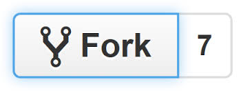
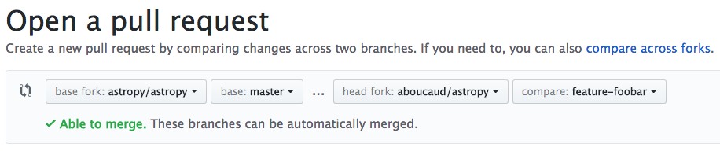
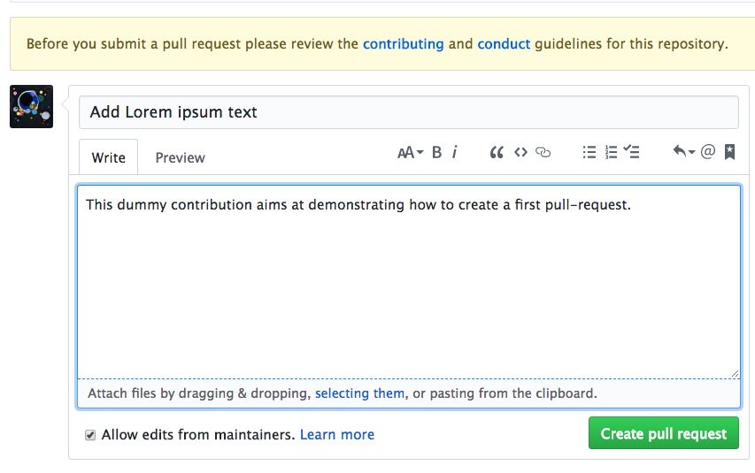

name: inverse
layout: true
class: underscore
---
class: center, middle, hero

.title[
  # .red[git] collaborative workflow
  ## Alexandre Boucaud
]

.bottom[.small[https://aboucaud.github.io/slides/2017/git-advanced]]

???

Speaker notes go after ???

Toggle speaker view by pressing P

Pressing C clones the slideshow view,
which is the view to put on the projector
if you're using speaker view.

Press ? to toggle keyboard commands help.

---

## Foreword

Notions to be familiar with.red[*]

* basic workflow: `add`, `commit`, `push`
* branching: `branch`, `checkout`
* merging: `merge` with fast-forward and without

.footnote[.red[*] otherwise check out the [beginners tutorial][gitbeg]]

[gitbeg]: https://aboucaud.github.io/slides/2017/git-tutorial

---

# Agenda

1. [Commit messages](#commit)
2. [Local rebasing](#rebase)
3. [Fork and pull-request](#fork)
4. [Resolving conflicts](#conflict)
5. [Collaborative files](#files)
6. [Continuous Integration](#ci)

---
name: commit
class: center, middle

# 1. Writing .red[good] commit messages

---

## Lazy messages are useless

```
$ git log --oneline -5
dfb1fa4 Fixup
98e0832 Update
7848d7f New commit
c95fd42 Commit
f124acb First commit
```

A commit message = .red[quick doc] for others & for the future.

Others = .red[YOU] in 3 months.

---

## Commit message tip #1

.red[1st line:] < 50 chars & imperative present

```
Fix incorrect variable name
```

rather than

```
I fixed the name of the variable in the function since I decided
it was prettier that way
```

---

## Commit message tip #2

If more details needed (justification or important changes):

* Blank line before details
* Details paragraph(s) wrapped to < 72 chars

---

## Commit message tip #3

Use .red[Markdown syntax]
  * headers
  * italics, bold
  * lists
  * URL links

Auto-close issues on server using hooks (e.g. Fixes #42)

---
name: rebase
class: center, middle

# 2. Local .red[interactive] rebasing

---

## Tip #1: interactive rebase should be a reflex

git motto: _"commit often, push when needed"_

=> .red[clean up] your log before pushing.

Review all commits since last `push`
```
$ git log --oneline --graph --decorate @{push}..
```
Use interactive rebase to reorder, rewrite or concatenate commits
```
$ git rebase -i
```

---

## Tip #2: `pull` default behavior is not your friend

.red[pull] = .red[fetch] + .red[merge]

Collaborators working on the same branch merge all the time upon itself.
This creates a .red[messy graph]
```
| *   af0d902 Merge branch 'datamodelPipeline' of http://euclid-git.roe.ac.uk/PF-MER/MER_Pipeline.git into datamodelPipeline
| |\
| | *   ad8735d Merge remote-tracking branch 'origin/develop' into datamodelPipeline
| | |\
| |_|/
|/| |
* | | 2012bfe Correct a bug in the transformation from a weight image to a flag image.
| * | ddc357e Implement some use of the data model items in the mosaicing step.
| |/
* | 057d87e Version to be merged with the development branch.
```

---

## Setting `pull.rebase` to `preserve`

```
$ git pull --rebase=preserve       # live
$ git config pull.rebase preserve  # configuration setting
```

**Idea**: rebase on top of the updated remote branch.

It maintains a .red[clean graph] with a single line per branch.

```
| |\
| | * c5dfa84 Fix zero point setter: getter method outputs a dictionary
| | * 723f9fd Fix temporary files path with tphot_convolve
| | *   69d0650 Merge branch 'kernel' into kernel
| | |\
| | * | 614c9ec Remove install_script instruction
| | * | 5069791 Fix bad indentation
```

---
name: fork
class: center, middle

# 3. The .red[pull-request] workflow

---

## General .red[workflow] for open source software

1. Copy original project .pull-right[_fork_]
2. Work on a feature/bug .pull-right[_feature branch_]
3. Synchronize with base .pull-right[_rebase upstream_]
4. Submit your work .pull-right[_pull-request_]
5. Repeat 2-4 .pull-right[_workflow_]

---

## Usual convention for remote names

| remote name | repo  |
| :--------: | :-----------------: |
| `origin`   | personal fork       |
| `upstream` | original repository |
| `johndoe` | johndoes's fork |

---

## Forking a project  .small[eg: `foobar`]

Create a fork .pull-right[]
```
$ BASE_URL=https://github.com/<foobar_owner>/foobar
$ FORK_URL=https://github.com/<you>/foobar
```

--

Clone the fork
```
$ git clone $FORK_URL
```

--

Add the original repository as remote
```
$ cd foobar
$ git remote add upstream $BASE_URL.git
```

.small[https://help.github.com/articles/fork-a-repo/]

---

## Synchronizing with target branch

Before creating the pull-request, make sure to .red[synchronize] your work with the original repo.

Retrieve new commits
```
$ git fetch upstream
```
and apply the target branch ones on top of your work
```
$ git rebase upstream/<target_branch>  <-- generally master
```

In case of a .red[conflict], refer to the [next section](#conflict) to learn how
to deal with it.

---

## Initiating a pull-request

To initiate a pull-request, the easiest might be to use the web interface.

Go to your fork repository and if you just pushed, it should display.red[*]

.center[]

Click on the green button _Compare & pull request_ to proceed.

.footnote[.small[.red[*] this is biased towards GitHub but works all the same on GitLab or BitBucket with a slightly different naming

(e.g. _merge request_ on GitLab)]]
---

## Choose the right target branch

Make sure the designated .red[target branch] of the pull-request is the one you aim at, or change it.

.center[]

Here it the target branch, a.k.a. "base" is set to `master`.

---

## Pull-request creation

Write a .red[meaningful] pull request title and content as you would in a [good commit message](#commit)

.center[]

---

## Pull request tips

Use [Markdown][md] syntax in the messages.

Writing `Fix #15` in the PR message or any commit message .red[closes the] related .red[issue] when the PR is merged.

.red[Maintainer's time is precious], be a nice contributor by following the contributing guide (see [part 5](#files)).

Some of shorthand commonly used is defined on the next slide.

---

## Pull-request .red[shorthand] .small[(non exhaustive)]

| shorthand | meaning |
| :-: | :-:|
| PR    |  _pull-request_               |
| WIP   |  _work in progress_           |
| ENH   |  _enhancement_                |
| MRG   |  _asking for review_          |
| MRG+n |  _already reviewed n times_   |
| LGTM  |  _looks good to me_           |
| IMHO  |  _in my humble opinion_       |

---
name: conflict
class: center, middle

# 4. Resolving merge .red[conflicts]

---

## What is a conflict ?

During a _merge_ or a _rebase_, git may complain about conflicts and put
things .red[on hold], waiting for an intervention.

It means there are .red[divergences] between the current working branch and the one that will be merged into.

An .red[action] is required to select one version or the other.

---

## Anatomy of a conflict

Let's say the conflict concerns `foo.py`.

The file will contain one or several occurances of the following blocks

```
<<<<<<< HEAD

bar     <-- content of remote branch

=======

baz     <-- content of your current working branch

>>>>>>> <commit title|hash that created the conflict>
```

---

## Solving the conflict

In order to **solve** the conflict, a choice must be made between the two options
, that is for `foo.py`
```
bar
```
or
```
baz
```

Make sure .red[to remove] the `<<<<`, `====` and `>>>>` lines.

---

## Resuming the merge

Once the conflicts have been solved, the conflicting files .red[must be staged] again for
merging/rebasing to resume.

```
$ git add foo.py
$ git rebase --continue
```

.footnote[**Note**: .red[do not commit] the conflicting files, just `git add`.]

---

## Conflicts and git history

The changes made to solve a conflict result in a .red[modification of the commit history]. When trying to push, git will complain and ignore as a safety procedure.

<!-- At any attempt to push the latest changes to the remote, git will complain that you are trying to rewrite history and ignore as a safety procedure. -->

One thus needs to _force push_ to the server
```
$ git push --force origin <feature_branch>
```

**Warning**: _force pushing_ can potentially destroy work so .red[double check] the log before doing so. This functionality is generally disabled on the `master` branch.

---
name: files
class: center, middle

# 5. .red[Important] collaborative files

---

## .red[Markdown] everywhere

Most often, the text files found at the root of a project are written in [Markdown][md].

They are recognizable by the `.md` extension.

Markdown has a .red[very convenient] [syntax][syntax] to write easy-to-read text files then converted to HTML.

The following files are commonly written in it.

For a richer syntax, to write e.g. API docs, people rather use [reStructuredText][rst] = `.rst`.

[md]: https://daringfireball.net/projects/markdown/
[syntax]: https://daringfireball.net/projects/markdown/syntax
[rst]: http://docutils.sourceforge.net/rst.html

---
class: middle

## README

---

## Content of a good README .small[(for code)]

* synopsis (elevator pitch)
* usage / code example
* motivation / rationale
* installation / getting started
* contributors
* links to docs / license / contribution guide

---
class: middle

## LICENSE

---

## Always give your code a license !

No license = _“all rights reserved”_ => .red[can't use] this code

.center[]

As a rule of thumb for open source<br>
  \- MIT and BSD are more permissive (and most used)<br>
  \- GPL-like are more conservative.

Learn more [here][ghlicense] or at [choosealicense.com](https://choosealicense.com)*

.footnote[.small[\* only a few are represented there]]

[ghlicense]: https://help.github.com/articles/licensing-a-repository/

---
class: middle

## CHANGELOG

---

## Keep the version history

A `CHANGELOG` is a .red[curated] version of .red[notable changes] between releases in a project.

For a very clear case, visit

.center[http://keepachangelog.com/]

---
class: middle

## CONTRIBUTING

---

## Collaborating HOW-TO

A .red[set of guidelines] written by the maintainers.

Explains how contributors are expected to do things.

.middle[.center[**.red[Do read] this file before submitting a pull-request !**]]

---
name: ci
class: center, middle

# 6. .red[C]ontinuous .red[I]ntegration

---
class: center, middle

## see dedicated presentation [here][gitcipres]

[gitcipres]: https://aboucaud.github.io/slides/2017/gitlab-ci

---

## Links

[Official documentation](https://git-scm.com/doc)

**Beginners**

* [Try git](https://try.github.io) - *interactive tutorial*

* [git - the simple guide](http://rogerdudler.github.io/git-guide/)

**Advanced users**

* [Atlassian tutorials](https://www.atlassian.com/git/tutorials)

* [Successful branching model](http://nvie.com/posts/a-successful-git-branching-model/)

---

class: center, middle, hero

.title[
  # Thank You
  ### [aboucaud@apc.in2p3.fr][abcd]
  ]

.footnote[
  .small[
  This work is licensed under a [Creative Commons Attribution-ShareAlike 4.0 International License][cc]
  ]
[][cc]
]

[abcd]: mailto:aboucaud@apc.in2p3.fr
[cc]: http://creativecommons.org/licenses/by-sa/4.0
