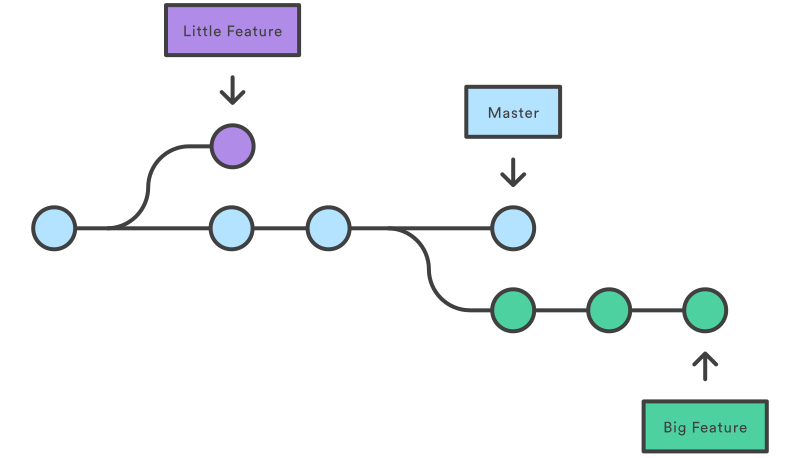
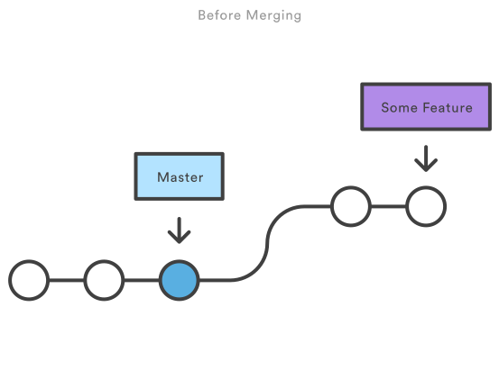
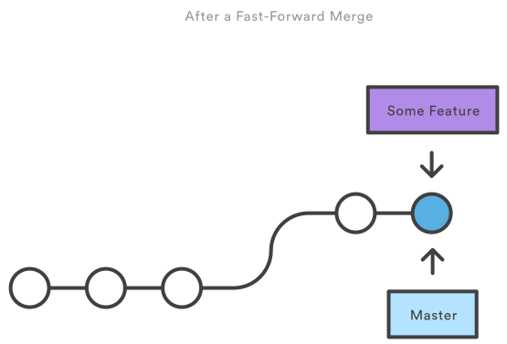

name: inverse
layout: true
class: underscore
---
class: center, middle, hero

.title[
  # .red[git] tutorial
  ## Alexandre Boucaud
]

.bottom[.small[https://aboucaud.github.io/slides/git-tutorial]]

???

Speaker notes go after ???

Toggle speaker view by pressing P

Pressing C clones the slideshow view,
which is the view to put on the projector
if you're using speaker view.

Press ? to toggle keyboard commands help.

---

## git vs. GitLab

.center[
   <br/>
  .caption[from https://jahya.net/blog/git-vs-github/]
]

* **git** is a versioning .red[software] keeping track of code changes, like **Mercurial** or **Subversion**.

* **GitLab** (or **Github**, **Bitbucket**, ...) are .red[servers] used to remotely store git repositories

<!-- .footnote[.red.bold[*] Important footnote] -->

---

## git pros and cons

* .red[distributed] version control (local commits)
* quick and easy branching
* records file .red[changes] not file contents
* we are in **2017** !

BUT

* more complex than mercurial or SVN
* requires a good .red[workflow] (reason you are **here**)


---

# Agenda

1. [Git and GitLab setup](#setup)
2. [Basic workflow](#workflow)
3. [git terminology](#terminology)
4. [Commands summary](#commands)
5. [Practice session](#practice)
6. [Wrap up and tips](#tips)

---
name: setup
class: center, middle

# 1. Setup

---

## Installing git

git should be installed .red[by default] in most distributions.

For a manual install, consider

```bash
brew install git     # on OSX
```
```bash
apt-get install git  # on Ubuntu
```
For Windows try https://git-scm.com/downloads.

If above not working, see [here](https://git-scm.com/book/en/v2/Getting-Started-Installing-Git).

---

## git setup

To get started, only the user info are needed
(for commits)

```bash
git config --global user.name "Prenom Nom"
git config --global user.email "prenom.nom@ias.u-psud.fr"
```

These global options live in `~/.gitconfig`.

Tip: terminal colors for git
```bash
git config --global color.ui auto
```

---

## GitLab setup

* go to https://git.ias.u-psud.fr/

.center[]

* authenticate with LDAP to create your account

---
name: workflow
class: center, middle

# 2. Basic workflow

---

## Initialization

To start .red[versioning a project], go to its root directory (empty or not) and use `git init`

```bash
$ cd /tmp/newproject
$ git init
Initialized empty Git repository in /tmp/newproject/.git/
```

Then start .red[tracking a file], using `git add`
```bash
$ touch README.md                  # create file
*$ git add README.md                # add tracking
$ git commit -m "Add README file"  # create first commit
```

---

## Synchronizing with a server

Create a new project on the server. <br/>
Locally .red[register the remote] project as `origin`
```bash
git remote add origin https://server/username/project.git
```
Push the local commits of the `master` branch to the server and set it as *upstream*:
```bash
git push -u origin master  # -u stands for upstream
```
For next commits, .red[simply use]
```bash
git push
```

---

## Cloning an existing project

To checkout a project from a server (public or private) with its .red[whole history], use `git clone`

```bash
git clone https://gitserver/username/project.git
```
will
* create a project directory at the current location
* download the project files from the `master` branch
* set the remote server `origin` to `https://gitserver/username/project.git`

---

## Basic workflow

- Modify some files, e.g. `file1.txt` and `file2.txt`
- **Add** files to the staging area

```bash
git add file1.txt file2.txt
```

- **Commit** the files change with .red[meaningful] message

```bash
git commit -m "Correct typos"
```

- **Push** the commits to the server

```bash
git push
```

---

## In case of trouble..

1. `git status` <br/>
   =>  repository status and list of commands for common tasks
2. `git help`
3. Check the [official documentation](https://git-scm.com/doc)
4. "Google is your friend"

---
name: terminology
class: center, middle

# 3. git terminology

---

## Changes

Once a file is tracked, a .red[file change] is either

- file creation, renaming or deletion.
- modification of a line in a file (insertion, deletion)

`git diff` shows the difference between the current file and the last commit.

---

## Commits

Commits are .red[series of changes] that records incremental updates to a series of files.

The philosophy behind git is to .red[commit often].

Each commit has a .red[unique hash] that serves as ID. <br/>
This hash can be obtained from the log

```bash
$ git log --oneline        # --oneline = view synthetic log
a4f4dcc Add README file
```

`a4f4dcc` is the hash , followed by the commit msg.

---

## Branches

A branch is .red[linear] series of commits.

.center[
   <br/>
  .caption[from https://www.atlassian.com/git/tutorials]
]

The default (main) branch is called `master`. <br/>
.red[Feature] branches depart from `master`.

---

## Branches

One can create a feature branch at any time from `master`

```bash
git branch feature master  # create the feature branch
git checkout feature       # move to the feature branch
```
or in a single step
```bash
git checkout -b feature master  # create & move to
```

---

## Merging

`git merge` is used to merge the commits of one branch into another branch.

Two merging processes can occur:
- **3-way merge:** when the .red[branches have diverged] and need *reconciliation*.
- **fast-forward merge:** when the .red[commit history] can be kept .red[linear]. This is equivalent to *rebasing*.red[*].

.footnote[.red[*] will be discussed in the advanced course.]


---

## 3-way merge - before

.center[
    <br/>
  .caption[from https://www.atlassian.com/git/tutorials]
]

---

## 3-way merge - after

.center[
    <br/>
  .caption[from https://www.atlassian.com/git/tutorials]
]

---

## Fast-forward merge - before

.center[
   <br/>
  .caption[from https://www.atlassian.com/git/tutorials]
]

---
## Fast-forward merge - after

.center[
    <br/>
  .caption[from https://www.atlassian.com/git/tutorials]
]

---

## Merging

To merge the `feature` branch into `master`, on need to point to master first and then merge :

```bash
git checkout master
git merge feature
```

One can then delete the `feature` branch

```bash
git branch -d feature  # -d stands for delete
```

---
name: commands
class: center, middle

# 4. Commands summary

---

## Basic commands summary

* `init`: to initialize tracking on a repository
* `status`, `diff`: show repo info and file changes
* `add`: select file for versioning and stage files for commit
* `commit`: commit the staged files
* `clone`, `push`, `pull`: synchronize with remote server
* `branch`, `checkout`: create, interact with branches
* `merge`, `rebase`: merge branch history


---

## Command comparison 1/2

| Subversion (SVN)  | Mercurial (Hg)      | Git                          |
| :---------------- | :------------------ | :--------------------------- |
| svn add           | hg add              | git add                      |
| svn cat           | hg cat              | git show                     |
| svn checkout      | hg clone            | git clone                    |
| svn commit        | hg commit ; hg push | git commit -a ; git push     |
| svn delete / svn remove | hg remove     | git rm                       |

---

## Command comparison 2/2

| Subversion (SVN)  | Mercurial (Hg)      | Git                          |
| :---------------- | :------------------ | :--------------------------- |
| svn diff          | hg diff             | git diff                     |
| svn help          | hg help             | git help                     |
| svn log           | hg log              | git log                      |
| svn status        | hg status           | git status                   |
| svn update        | hg pull --update    | git pull                     |
| svn move/rename   | hg move/rename      | git mv                       |

---
name: practice
class: center, middle

# 5. Practice session

---

## TODO #1

1. Create `tutorial` project on GitLab
2. Follow instructions to initialize `tutorial` project on your computer
3. Create a `README.md` ([see syntax](https://git.ias.u-psud.fr/help/user/markdown))
4. Modify the file, commit and push
6. Iterate over 4. and .red[monitor changes] on the project landing page on GitLab

---

## TODO #2

1. Create branch `feature1`
2. Modify `README.md` and commit the changes
3. Switch to branch `master`
4. Try to merge `feature1` into `master`
5. If conflict, try to resolve it
6. Delete branch `feature1`

---

## TODO #3

1. Create branch `feature2`
2. Modify `README.md` and commit the changes
3. Switch to branch `master`
3. Modify `README.md` and commit the changes
4. Try to merge `feature2` into `master`
5. If conflict, try to resolve it
6. Delete branch `feature2`

---
name: tips
class: center, middle

# 6. Wrap up and tips

---

## .gitignore

By default a file .red[not versioned] in a git repository is marked as .red[*untracked*] on a `git status` call.

Adding a file, file type of folder in a `.gitignore` file at the root of the git repo makes sure they are ignored.
<!-- To make sure a given file, file type, or folder is completely ignored, it needs to be added to a `.gitignore` file at the root of the git repo. -->

**Tip:**
> [joe](https://github.com/karan/joe) provides .gitignore template files for the majority of programming languages and can serve as a good starting point.

---

## Tip: git prompt
When in a git repository, [bash-git-prompt][bgp] displays the .red[current branch name]  and .red[status info] in your prompt


* `master` is the current branch
* the valid sign means the repository is clean <br/>
(no commits to push, files changes or stashed or even untracked)

[bgp]: https://github.com/magicmonty/bash-git-prompt

---

## Links

[Official documentation](https://git-scm.com/doc)

**Beginners**

* [Try git](https://try.github.io) - *interactive tutorial*

* [git - the simple guide](http://rogerdudler.github.io/git-guide/)

**Advanced users**

* [Atlassian tutorials](https://www.atlassian.com/git/tutorials)

* [Successful branching model](http://nvie.com/posts/a-successful-git-branching-model/)


<!-- ---

<small>
<br />
&copy; Copyright 2016, Alexandre Boucaud
<br />
alexandre.boucaud@ias.u-psud.fr
<br />
<br />
This work is licensed under a <a rel="license" href="http://creativecommons.org/licenses/by-sa/4.0/">Creative Commons Attribution-ShareAlike 4.0 International License</a>.
</small>
 -->
---

class: center, middle, hero

.title[
  # Thank You
  ### [aboucaud@ias.u-psud.fr][abcd]
  ]

.footnote[
  .small[
  This work is licensed under a [Creative Commons Attribution-ShareAlike 4.0 International License][cc]
  ]
[][cc]
]

[abcd]: mailto:aboucaud@apc.in2p3.fr
[cc]: http://creativecommons.org/licenses/by-sa/4.0
