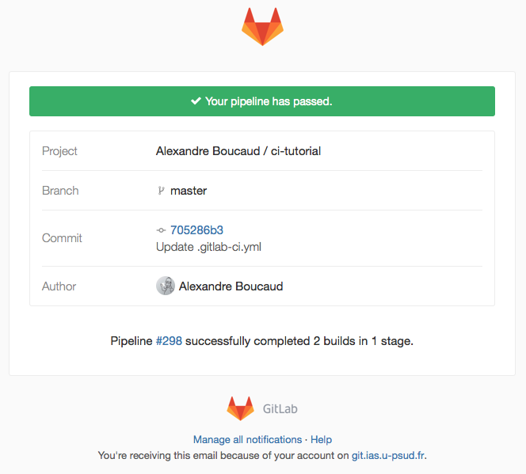

name: inverse
layout: true
class: underscore
---
class: center, middle, hero

.title[
  # .red[C]ontinuous .red[I]ntegration</br>with GitLab .red[CI]
  ## Alexandre Boucaud
]

.bottom[.small[https://aboucaud.github.io/slides/2017/gitlab-ci]]

---
name: infos

## Information

.red[Demie-journée] LOOPS .red[intégration continue]

**lundi 27 mars de 13h30 à 18h** au [Proto204][proto]
* REx sur
    * *Jenkins*
    * *Travis* / *CircleCI* / *AppVeyor*
* mise en pratique avec `C++`, `Java` ou `Python`
* [annonce][loopspage] et [inscription][indico]

[loopspage]: https://reseau-loops.github.io/journee_2017_03_IntegrationContinue.html
[indico]: https://indico.apc.in2p3.fr/event/3445/
[proto]: http://proto204.co/#contact_us

---

# Agenda

1. [Testing](#intro)
2. [Continuous integration](#ci)
3. [Getting started with GitLab CI](#gitlabci)
4. [Advanced testing](#advanced)

---
name: intro
class: center, middle

# 1. Testing

---

## What is a test ?

* A .red[description] of how the software is intended to work.
* A piece of code that can be run against the software to .red[verify] it
* A way to increase both .red[trust] and .red[confidence] in a software

---

## Types of tests

* .red[Unit] tests
    * test isolated methods / functions
    * high coverage
* .red[Integration] tests
    * can use test data
    * fill in the cracks between unit tests
* .red[System] tests
    * end-to-end tests with proper configuration
    * system specific
* .red[Acceptance] tests
    * customer use cases

---

## Test Driven Dev. (TDD)

.center[
   <br/>
  .caption[source https://frama.link/Bx437ods]
]

---

## Basic collaborative workflow

.pull-left[
* unit tests
* coverage tests
* static code analysis
* plateform specific builds
]
.pull-right[.right[
   <br/>
  .caption[source https://frama.link/Bx437ods]
] ]

---

## Basic collaborative workflow

.pull-left[
* unit tests
* coverage tests
* static code analysis
* plateform specific builds

VS.

* automated testing
]
.pull-right[.right[
   <br/>
  .caption[source https://frama.link/Hwot9vDS]

   <br/>
  .caption[source https://frama.link/7_x9KnK3]
] ]

---
name: ci
class: center, middle

# 2. Continuous integration (CI)

---

## Common workflow

1. Developer .red[pushes] code to repository
2. CI daemon .red[builds] project and .red[runs tests]
3. Dev. is .red[notified] of build result


---

## Main plateforms

* [Jenkins][jenkins] .red[*]
* [Travis][travis] .red[*]
* [Circle CI][circleci] .red[*]
* [AppVeyor][appveyor] .red[*]
* [GitLab CI][gitci]  <= this talk

.bottom[
  .red.bold[*] see next [LOOPS event](#infos)
  ]

[jenkins]: https://jenkins.io/
[travis]: https://travis-ci.org/
[appveyor]: https://www.appveyor.com/
[circleci]: https://circleci.com/
[gitci]: https://about.gitlab.com/gitlab-ci/

---

## GitLab CI

Continuous integration is integrated into *GitLab*

.left[


]

.center[
[docs](http://docs.gitlab.com/ee/ci/) & [quick start guide](https://docs.gitlab.com/ce/ci/quick_start/)
]
---
name: gitlabci
class: center, middle

# 3. Getting started with GitLab CI

---

## Executors

To build projects and run tests, GitLab needs [executors][exec].

.center[
    
    ]

To be installed by the server administrator.

[exec]: https://docs.gitlab.com/runner/executors/

---

## .gitlab-ci.yml

CI requires a single configuration file at .red[root] of the project.

```yaml
# requirements for testing
before_script:
  - pip install pytest

# script #1
python:
  script:
    - python -m pytest
```

Can be tested [here][civalidate] before commiting.

[civalidate]: https://git.ias.u-psud.fr/ci/lint

---

## Build status

Once configured, the .red[CI status] will appear on the project main page

.center[
    
    ]

To relay that information elsewhere, a build status .red[badge] is also available ![img][buildbadge].

It can be accessed through
```html
https://<server>/<user>/<project>/badges/<branch>/build.svg
```

[buildbadge]: https://git.ias.u-psud.fr/aboucaud/test_gitlab-ci_python/badges/master/build.svg
---

## Email notifications

.center[
    
    ]

---

name: demo
class: center, middle

# DEMO

---
name: advanced
class: center, middle

# 4. Advanced testing

---

## Custom build image (using Docker)

```Dockerfile
*FROM debian:stretch

MAINTAINER Alexandre Boucaud <alexandre.boucaud@ias.u-psud.fr>

RUN apt-get update && \
    apt-get install -y \
        tox \
*       python2.7 \
        python-pip python-pytest-cov python-coverage \
        python-numpy python-matplotlib python-astropy \
        python-photutils python-healpy python-wcsaxes \
*       python3.5 \
        python3-pip python3-pytest-cov python3-coverage \
        python3-numpy python3-matplotlib python3-astropy \
        python3-photutils python3-healpy python3-wcsaxes
```
See the [container registry][cra] for images.
[cra]: https://git.ias.u-psud.fr/help/administration/container_registry.md

---

## Using custom image

```yaml
# custom image
image: abeelen/pyastro

# script #1
python27:
  script:
    - python2 -m pytest
  only: master

# script #2
python35:
  script:
    - python3 -m pytest
    - python3 -m pytest --cov=project
  allow_failure: true
```

More info [here][cijobs].

[cijobs]: https://docs.gitlab.com/ce/ci/yaml/#configuration-of-your-jobs-with-gitlab-ci-yml

---

## Coverage

If coverage tests are run in builds,
.red[coverage value] can be retrieved (GitLab CE > 8.17) via regular expressions.

.center[`Project Settings` > `CI/CD Pipelines` > `Test coverage parsing`]

Badge for coverage ![img][covbadge] can be accessed through

```html
https://<server>/<user>/<project>/badges/<branch>/coverage.svg
```
to be shown in the README.md, etc.

[covbadge]: https://git.ias.u-psud.fr/aboucaud/test_gitlab-ci_python/badges/master/coverage.svg

---

name: demo
class: center, middle

# [DEMO][tuto]

[tuto]: https://git.ias.u-psud.fr/aboucaud/ci-tutorial

---

## Links & references

* **git**
    * [git - the simple guide][gitsimple]
    * [try git][trygit] - *interactive tutorial*
    * [git tutorial][gittuto] - *given last month @ IAS*
* **tests**
    * [LOOPS day on testing][loopstest]
    * [Introduction to Unit Testing with Pytest][pycon16]
* **CI**
    * [GitLab CI docs][cidocs]
    * [What is CI ?][codeship]
    * [Introduction to Docker][docker]

[gittuto]: https://aboucaud.github.io/slides/2017/git-tutorial
[trygit]: https://try.github.io
[gitsimple]: http://rogerdudler.github.io/git-guide/

[loopstest]: https://reseau-loops.github.io/formation_test_2016_11.html
[pycon16]: https://speakerdeck.com/pycon2016/michael-tom-wing-christie-wilson-introduction-to-unit-testing-in-python-with-pytest

[cidocs]: https://git.ias.u-psud.fr/help/ci/README.md
[codeship]: https://codeship.com/continuous-integration-essentials
[docker]: http://talks.godoc.org/github.com/sbinet/talks/2016/20161202-envol-docker/talk.slide#1

---

class: center, middle, hero

.title[
  # Thank You
  ### [aboucaud@ias.u-psud.fr][abcd]
  ]

.footnote[
  .small[
  This work is licensed under a [Creative Commons Attribution-ShareAlike 4.0 International License][cc]
  ]
[][cc]
]

[abcd]: mailto:aboucaud@apc.in2p3.fr
[cc]: http://creativecommons.org/licenses/by-sa/4.0
