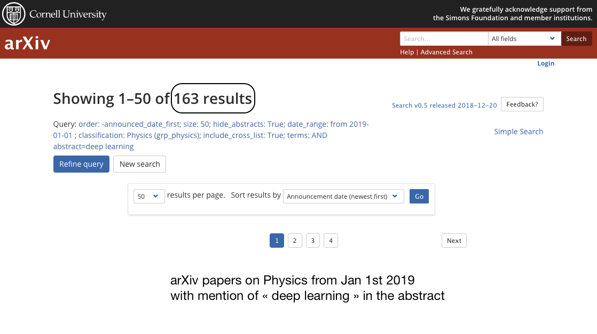
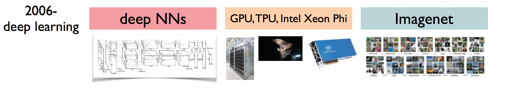
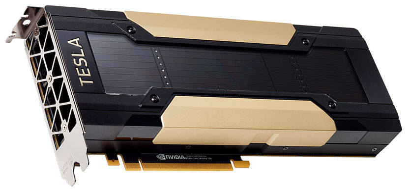
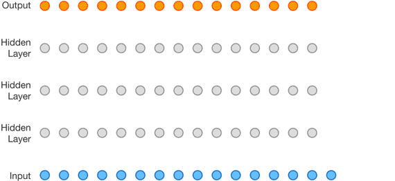
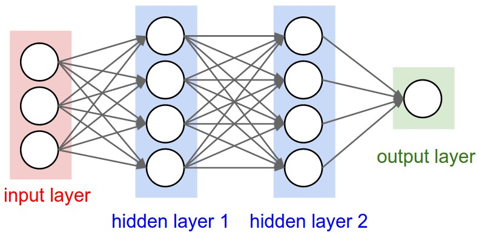
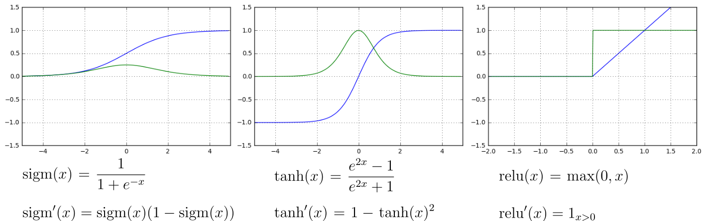
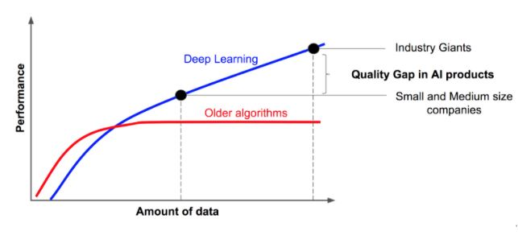

class: middle
background-image: url(img/brain.png)

# Hands on .red[deep learning]
#### CCIN2P3 GPU workshop - Apr 2019
.bottomlogo[]

.footnote[ Alexandre Boucaud  -  [@alxbcd][twitter]]

[twitter]: https://twitter.com/alxbcd
---
exclude: true
class: middle
background-image: url(img/brain.png)
.hidden[aa]
# Hands on .red[deep learning]
.small[with [Keras][keras] examples]
.footnote[Alexandre Boucaud  -  [@alxbcd][twitter]]


---
## Alexandre Boucaud 

Scientific software engineer at APC, CNRS

<!-- [aboucaud @ apc.in2p3.fr][mail]   -->
<!-- [@alxbcd][twitter] on twitter -->

</br>
.medium[Interests:]
- cosmological survey data processing (LSST, Euclid, LISA)
- ML applications in astrophysics (galaxy morphology, deblending)
- development of the open source Python scientific ecosystem

</br>
Disclaimer: I am .red[not] a machine learning researcher  


[mail]: mailto:aboucaud@apc.in2p3.fr
[twitter]: https://twitter.com/alxbcd

---
name: intro
background-image: url(img/news.png)

---
<!-- class: center, middle -->
## deep learning vs. physics arXiv


---
## What does "deep" means ?

.center[

]

.footnote[more on these common net architectures [here][archi]]

[archi]: https://www.jeremyjordan.me/convnet-architectures/

---
## A bumpy 60-year history


--


--


---
## An unprecedented trend 

deep learning computation power .red[doubles every 3.5-month]

.center[
  
]

.footnote[[_AI and Compute_ blog post, Amodei & Hernandez, 16-05-2018](https://blog.openai.com/ai-and-compute/)]

---
exclude: true
class: center, middle

## QUESTION:


### Why this recent .red[trend] ?

---
## Why this recent trend ?

- .medium[specialized .blue[hardware]] .right[e.g. GPU, TPU, Intel Xeon Phi]

--
- .medium[.blue[data] availability] .right[_big data era_]

--
- .medium[.blue[algorithm] research] .right[e.g. adversarial or reinforcement learning]

--
- .medium[.blue[open source] tools] .right[huge ecosystem right now]

---
## Graphics Processing Unit (GPU)

- **< 2000** : "graphics cards" (video edition + game rendering)

.center[]

---
count: false
## Graphics Processing Unit (GPU)

- **< 2000** : "graphics cards" (video edition + game rendering)
- .hidden[< ]**1999** : Nvidia coins the term "GPU" for the first time

--
- .hidden[< ]**2001** : floating point support on graphics processors

--
- .hidden[< ]**2005** : programs start to be faster on GPU than on CPU

--
- .hidden[< ]**2007** : first release of the [CUDA](https://developer.nvidia.com/cuda-zone) framework

.center[]

---
count: false
## Graphics Processing Unit (GPU)

- **< 2000** : "graphics cards" (video edition + game rendering)
- .hidden[< ]**1999** : Nvidia coins the term "GPU" for the first time
- .hidden[< ]**2001** : floating point support on graphics processors
- .hidden[< ]**2005** : programs start to be faster on GPU than on CPU
- .hidden[< ]**2007** : first release of the [CUDA](https://developer.nvidia.com/cuda-zone) framework
- .hidden[< ]**2018** : GPUs are part of our lives (phones, computers, cars, etc..)

.center[]
.footnote[credit: Nvidia Tesla V100]

---
## Computational power 
GPU architectures are .blue[excellent] for the kind of computations required by the training of NN

.center[]

| year | hardware | computation (TFLOPS) | price (K$) |
|------|:------:|:-----------:|:----:|
| 2000 | IBM ASCI White | 12 | 100 000 K |
| 2005 | IBM Blue Gene/L | 135 | 40 000 K |
| 2018 | Nvidia Tesla V100 | > 100 | 10 K |
<!-- | 2017 | Nvidia Titan V | > 100 | 3 K | -->

<!-- .footnote[[Wikipedia: Nvidia GPUs](https://en.wikipedia.org/wiki/List_of_Nvidia_graphics_processing_units)] -->

---
## Deep learning software ecosystem

.center[
  
]

---
## Deep learning today

.left-column[
- translation
- image captioning
- speech synthesis
- style transfer
]

.right-column[
- cryptocurrency mining
- self-driving cars
- games 
- etc.
]

.reset-column[]
.center[
  
]

---
## Deep learning today

.center[
  
]

---
## DL today: speech synthesis

.center[

]

.footnote[[WaveNet][wavenet] - TTS with sound generation - DeepMind (2017)]

[wavenet]: https://deepmind.com/blog/high-fidelity-speech-synthesis-wavenet/

---
## DL today: image colorisation

.center[

]
.center[

]

.footnote[[Real-time image colorization][deepcolor] (2017)]

[deepcolor]: https://richzhang.github.io/ideepcolor/

---
## DL today: strategic game bots

.center[

]

.footnote[[AlphaStar][alphastar] - Starcraft II AI - DeepMind (2019)]

[alphastar]: https://deepmind.com/blog/alphastar-mastering-real-time-strategy-game-starcraft-ii/

---
## DL today: data science world

.center[
 
]

.center[

]

.footnote[[rapids.ai][rapids] - Nvidia (2019)]

[rapids]: https://rapids.ai

---
class: center, middle

## PLAY TIME


### Which sound is .red[generated] ?

1)  <audio controls><source src="img/lipstick_gen.wav"></audio>
</br> 
2) <audio controls><source src="img/lipstick_gt.wav"></audio>

.footnote[[Tacotron 2][tacotron] - DeepMind (2017)]
[tacotron]: https://google.github.io/tacotron/publications/tacotron2/index.html

---
class: center, middle

## PLAY TIME

 ### Which face is .red[real] ?

.center[
  
]

.footnote[[whichfaceisreal.com][wfir] (2018)]

[wfir]: http://www.whichfaceisreal.com
---
class: center, middle

### The sucess of ML applications is blatant,

#### BUT

### we are still .red[far]* from "Artificial Intelligence".

.footnote[*see [nice post][mjordanmedium] by M. Jordan - Apr 2018]

[mjordanmedium]: https://medium.com/@mijordan3/artificial-intelligence-the-revolution-hasnt-happened-yet-5e1d5812e1e7 

---
exclude: true
class: center, middle

# For ML applications in astro see Emille's talk later

---

# Outline

.medium[[Neural nets](#nns)]

> hidden layers - activation - backpropagation - optimization

--

.medium[[Convolutional Neural Networks (CNN)](#cnn)]

> kernels - strides - pooling - loss - training


--
.medium[[In practice](#practice)]

> step-by-step - monitoring your training


--
.medium[[Common optimizations](#optim)]

> data augmentation - dropout - batch normalisation

---
## Foreword

The following slides provide examples of neural network models written in _Python_, using the [Keras][keras] library and [TensorFlow][tf] tensor ordering convention*. 

Keras provides a high level API to create deep neural networks and train them using numerical tensor libraries (_backends_) such as [TensorFlow][tf], [CNTK][cntk] or [Theano][theano].


[keras]: https://keras.io/
[tf]: https://www.tensorflow.org/
[cntk]: https://docs.microsoft.com/fr-fr/cognitive-toolkit/
[theano]: http://www.deeplearning.net/software/theano/

.center[
  
]

.footnote[*channels last]

---
class: middle, center
name: nns

# What is a .red[neural network] made of ?

---
## A Neuron

A neuron is a .green[linear system] with two attributes
> the weight matrix $\mathbf{W}$  
> the linear bias $b$

It takes .green[multiple inputs] (from $\mathbf{x}$) and returns .green[a single output]
> $f(\mathbf{x}) = \mathbf{W} . \mathbf{x} + b $
.center[
  
]

---
## Linear layers

A linear layer is an .green[array of neurons].

A layer has .green[multiple inputs] (same $\mathbf{x}$ for each neuron) and returns .green[multiple outputs].

.center[
  <!--  -->
  
]

---
## Hidden layers

All layers internal to the network (not input or output layer) are considered .green[hidden layers].

.center[]

.footnote[[cs231n.github.io](http://cs231n.github.io/)]

---
## Multi-layer perceptron (MLP)


.left-column[
```python
from keras.models import Sequential
from keras.layers import Dense

# initialize model
model = Sequential()

# add layers
model.add(Dense(4, input_dim=3))
model.add(Dense(4))
model.add(Dense(1))
```
]

.right-column[

]

---
count: false
## Multi-layer perceptron (MLP)
.left-column[
```python
from keras.models import Sequential
from keras.layers import Dense

# initialize model
model = Sequential()

# add layers
model.add(Dense(4, input_dim=3))
model.add(Dense(4))
model.add(Dense(1))
```
]
.right-column[

]

.hidden[aa]
.reset-column[]
.center[
.huge[QUESTION:]</br></br>
.big[How many .red[free parameters] has this model ?]
]

---
count: false
## Multi-layer perceptron (MLP)
.left-column[
```python
from keras.models import Sequential
from keras.layers import Dense

model = Sequential()

model.add(Dense(4, input_dim=3))
model.add(Dense(4))
model.add(Dense(1))

# print model structure
model.summary()
```
]
.right-column[

]
.reset-column[
```
__________________________________________________
Layer (type)          Output Shape        Param #
==================================================
dense_1 (Dense)       (None, 4)           16         <=   W (3, 4)   b (4, 1)
__________________________________________________
```
]

---
count: false
## Multi-layer perceptron (MLP)
.left-column[
```python
from keras.models import Sequential
from keras.layers import Dense

model = Sequential()

model.add(Dense(4, input_dim=3))
model.add(Dense(4))
model.add(Dense(1))

# print model structure
model.summary()
```
]
.right-column[

]
.reset-column[
```
__________________________________________________
Layer (type)          Output Shape        Param #
==================================================
dense_1 (Dense)       (None, 4)           16
__________________________________________________
dense_2 (Dense)       (None, 4)           20         <=   W (4, 4)   b (4, 1)
__________________________________________________
```
]

---
count: false
## Multi-layer perceptron (MLP)
.left-column[
```python
from keras.models import Sequential
from keras.layers import Dense

model = Sequential()

model.add(Dense(4, input_dim=3))
model.add(Dense(4))
model.add(Dense(1))

# print model structure
model.summary()
```
]
.right-column[

]
.reset-column[
```
__________________________________________________
Layer (type)          Output Shape        Param #
==================================================
dense_1 (Dense)       (None, 4)           16
__________________________________________________
dense_2 (Dense)       (None, 4)           20
__________________________________________________
dense_3 (Dense)       (None, 1)           5          <=   W (4, 1)   b (1, 1)
==================================================
Total params: 41
Trainable params: 41
Non-trainable params: 0
```
]

---
exclude: True

## Multi-layer perceptron (MLP)

```python
from keras.models import Sequential
from keras.layers import Dense

# initialize model
model = Sequential()

# add layers
model.add(Dense(4, input_dim=3))
model.add(Dense(4))
model.add(Dense(1))
```

--
exclude: True
```python
# print model structure
model.summary()
```

--
exclude: True
```bash
_________________________________________________________________
Layer (type)                 Output Shape              Param #
=================================================================
dense_1 (Dense)              (None, 4)                 16
_________________________________________________________________
dense_2 (Dense)              (None, 4)                 20
_________________________________________________________________
dense_3 (Dense)              (None, 1)                 5
=================================================================
Total params: 41
Trainable params: 41
Non-trainable params: 0
```

---

## Adding non linearities

A network with several linear layers remains a .green[linear system].

--

To add non-linearities to the system, .red[activation functions] are introduced. 

.center[]

---
count: false
## Adding non linearities

A network with several linear layers remains a .green[linear system].

To add non-linearities to the system, .red[activation functions] are introduced. 

.center[]

.footnote[credit: Alexander Chekunkov]

---

## Activation functions 

.hidden[a]  
.left-column[.blue[activation function] ]
.green[its derivative]


.center[]


An extended list of activation functions can be found on [wikipédia](https://en.wikipedia.org/wiki/Activation_function).

---

## Activation layer

There are two different syntaxes whether the activation is seen as a .green[property] of the neuron layer

```python
model = Sequential()
model.add(Dense(4, input_dim=3, activation='sigmoid'))
```

--

or as an .green[additional layer] to the stack

```python
from keras.layers import Activation

model = Sequential()
model.add(Dense(4, input_dim=3))
model.add(Activation('tanh'))
```

--
The activation layer .red[does not add] any .red[depth] to the network.

---
## Simple network


One neuron, one activation function.


.center[]

$$x \overset{neuron}\longrightarrow z(x) = wx + b\overset{activation}\longrightarrow a(x) = g(z(x)) = y$$


---
## Feed forward

$$ x \overset{neuron}\longrightarrow z(x) = wx + b\overset{activation}\longrightarrow a(x) = g(z(x)) = y$$
We propagate an input $x$ through the network and compare the result $y$ with the expected value $y_t$ using the loss function
$$ \ell = loss(y, y_t)$$

--
.hidden[a]
.center.red[How do we quantify the impact of $w$ and $b$ on the loss $\ell$ ?]

--
.hidden[a]
$$ \dfrac{\partial \ell}{\partial w} \quad \text{and} \quad \dfrac{\partial \ell}{\partial b} $$

---
## Backpropagation

A .green[30-years old] algorithm (Rumelhart et al., 1986)

which is .red[key] for the re-emergence of neural networks today.

.center[]

.footnote[credit: Alexander Chekunkov]

---
## Chain rule

Backpropagation works if networks are .green[differentiable].

.red[Each layer] must have an analytic derivative expression.

$$ x \overset{neuron}\longrightarrow z(x) = wx + b\overset{activation}\longrightarrow a(x) = g(z(x)) = y$$

--
Since $w$ and $b$ are also variables
$$ z(x, w, b) = wx + b\,, $$
the gradients can be expressed as
$$ \dfrac{\partial z}{\partial x} = w\,, \quad \dfrac{\partial z}{\partial w} = x \quad\text{and}\quad \dfrac{\partial z}{\partial b} = 1\,. $$
---
count:false
## Chain rule

Backpropagation works if networks are .green[differentiable].

.red[Each layer] must have an analytic derivative expression.

$$ x \overset{neuron}\longrightarrow z(x) = wx + b\overset{activation}\longrightarrow a(x) = g(z(x)) = y$$

Then the .red[chain rule] can be applied :

$$ \dfrac{\partial \ell}{\partial w} =
   \dfrac{\partial \ell}{\partial a} \cdot 
   \dfrac{\partial a}{\partial z} \cdot 
   \dfrac{\partial z}{\partial w} = \nabla loss(y) \cdot g'(z) \cdot x $$
and
$$ \dfrac{\partial \ell}{\partial b} =
   \dfrac{\partial \ell}{\partial a} \cdot 
   \dfrac{\partial a}{\partial z} \cdot 
   \dfrac{\partial z}{\partial b} = \nabla loss(y) \cdot g'(z)$$

---
## Network with more layers

Let's add one layer (with a single neuron) with the .green[same] activation $g$
<!-- $$ x \longrightarrow z_1 = w_1x + b_1\longrightarrow a_1 = g(z_1(x)) \downarrow$$ -->
<!-- $$  y = a_2 = g(z_2(x)) \longleftarrow z_2 = w_2a_1 + b_2$$ -->
$$ x \longrightarrow z_1 = w_1x + b_1\longrightarrow a_1 = g(z_1(x)) \rightarrow$$
$$ \rightarrow z_2 = w_2a_1 + b_2 \longrightarrow a_2 = g(z_2(x)) = y $$
--
.center.red[How do we compute the gradients of $w_1$ : $\dfrac{\partial\ell}{\partial w_1}$ ?]
--
.footnote[Hint: remember the algorithm is called .green[backpropagation]]

---
## Network with more layers

Let's add one layer (with a single neuron) with the .green[same] activation $g$
<!-- $$ x \longrightarrow z_1 = w_1x + b_1\longrightarrow a_1 = g(z_1(x)) \rightarrow$$
$$ \rightarrow z_2 = w_2a_1 + b_2 \longrightarrow a_2 = g(z_2(x)) = y $$ -->
$$ x \longrightarrow z_1 = w_1x + b_1\longrightarrow a_1 = g(z_1(x)) \rightarrow$$
$$ \rightarrow z_2 = w_2a_1 + b_2 \longrightarrow a_2 = g(z_2(x)) = y $$
We use the .red[chain rule]

$$ \dfrac{\partial \ell}{\partial w_1} =
   \dfrac{\partial \ell}{\partial a_2} \cdot 
   \dfrac{\partial a_2}{\partial z_2} \cdot 
   \dfrac{\partial z_2}{\partial a_1} \cdot 
   \dfrac{\partial a_1}{\partial z_1} \cdot 
   \dfrac{\partial z_1}{\partial w_1} $$
--
which simplifies to

$$ \dfrac{\partial \ell}{\partial w_1} =
   \nabla loss(y) \cdot 
   g'(z_2) \cdot 
   w_2 \cdot 
   g'(z_1) \cdot 
   x $$
   <!-- = \dfrac{\partial \ell}{\partial a} \cdot g'(z) \cdot x $$ -->

---
## Network with more layers

From the latest expression

$$ \dfrac{\partial \ell}{\partial w_1} =
   \left(
     \nabla loss(y) \cdot 
     g'(z_2) \cdot 
     w_2 \right)\cdot 
   g'(z_1) \cdot 
   x $$

one can derive the algorithm to compute .green[the gradient for a layer] $z_i$
$$ \dfrac{\partial \ell}{\partial z_i} =
\left(
\left(\nabla loss(y) \cdot 
  g'(z_n) \cdot 
  w_n \right) \cdot 
  g'(z^{n-1}) * w^{n-1}\right)
  [\dots]  \cdot g'(z_i) $$

which can be re-written as .red[a recursion]

$$ \dfrac{\partial \ell}{\partial z_i} = \dfrac{\partial \ell}{\partial z^{i+1}} \cdot w^{i+1} \cdot g'(z_i) $$
--
.footnote[find a clear and more detailed explaination of backpropagation [here](https://www.jeremyjordan.me/neural-networks-training/)]

---
## Network update

1. feedforward and compute loss gradient on the output
$$ \nabla loss(y) $$

2. for each layer in the backward direction, 
  * .blue[receive] the gradients from the previous layer, 
  * .blue[compute] the gradient of the current layer
  * .blue[multiply] with the weights and .blue[pass] the results on to the next layer

3. for each layer, update their weight and bias using their own gradient, following the optimisation scheme (e.g. gradient descent)

---
exclude: true
class: middle, center

## QUESTION:

### How would you feed images to a network ?

---
class: middle, center
name: cnn

# .red[Convolutional] Neural Networks

---

## Convolutional Neural Networks

- elegant way of passing .green[tensors] to a network
- perform convolutions with .green[3D kernels] 
- training optimizes kernels, not neuron weights

.center[
  
]

---
## Convolutional layers

.left-column[
```python
from keras.models import Sequential
from keras.layers import Conv2D

model = Sequential()
# First conv needs input_shape
# Shape order depends on backend
model.add(
    Conv2D(15,       # filter size 
           (3, 3),   # kernel size
           strides=1,       # default
           padding='valid', # default
           input_shape=(32, 32, 3)))
# Next layers don't
model.add(Conv2D(16, (3, 3) strides=2))
model.add(Conv2D(32, (3, 3)))
```
]

.right-column[

] 

.reset-columns[
  <br/> <br/> <br/> <br/> <br/> <br/> <br/> <br/> <br/>  <br/> 
- **kernel properties**: .green[size] and number of .green[filters]
- **convolution properties**: .green[strides] and .green[padding]
- output shape depends on .red[**all**] these properties
]


---
## No strides, no padding

.left-column[
```python
from keras.models import Sequential
from keras.layers import Conv2D

model = Sequential()
model.add(
    Conv2D(1, (3, 3), 
           strides=1,        # default
           padding='valid',  # default
           input_shape=(7, 7, 1)))
model.summary()
```

```
_________________________________________
Layer (type)            Output Shape     
=========================================
conv2d (Conv2D)         (None, 5, 5, 1)  
=========================================
Total params: 10
Trainable params: 10
Non-trainable params: 0
_________________________________________
```
] 
.right-column[

] 


.footnote[[arXiv:1603.07285](https://arxiv.org/abs/1603.07285)]
---
## Strides (2,2) + padding

.left-column[
```python
from keras.models import Sequential
from keras.layers import Conv2D

model = Sequential()
model.add(Conv2D(1, (3, 3), 
*                strides=2, 
                 padding='same', 
                 input_shape=(5, 5, 1)))
model.summary()
```

```
_________________________________________
Layer (type)            Output Shape     
=========================================
conv2d (Conv2D)         (None, 3, 3, 1)  
=========================================
Total params: 10
Trainable params: 10
Non-trainable params: 0
_________________________________________
```
]
.right-column[ 

]

.footnote[[arXiv:1603.07285](https://arxiv.org/abs/1603.07285)]

---
## Activation

.left-column[
```python
from keras.models import Sequential
from keras.layers import Conv2D

model = Sequential()
model.add(Conv2D(1, (3, 3), 
*                activation='relu'
                 input_shape=(5, 5, 1)))
```
]

.right-column[ 

]

.reset-columns[
  </br>
  </br>
  </br>
  </br>
  </br>
  </br>
- safe choice*: .medium.red[use ReLU] for the convolutional layers
- select the activation of the last layer according to your problem
.small[e.g. sigmoid for binary classification]
]

.footnote[*not been proven (yet) but adopted empirically]
---
## Pooling layers

- reduces the spatial size of the representation (downsampling)<br/>
=> less parameters & less computation
- common method: **`MaxPooling`** or **`AvgPooling`**
- common strides: (2, 2)

.center[
  
]
.footnote[[cs231n.github.io](http://cs231n.github.io/)]

---
## Pooling layers

.left-column[
```python
from keras.models import Sequential
from keras.layers import Conv2D
from keras.layers import MaxPool2D

model = Sequential()
model.add(Conv2D(1, (3, 3), 
                 strides=1, 
                 padding='same', 
                 input_shape=(8, 8, 1)))
model.add(MaxPool2D(((2, 2))))
model.summary()
```

```
__________________________________________________
Layer (type)          Output Shape        Param #
==================================================
conv2d_1 (Conv2D)     (None, 8, 8, 1)     10
__________________________________________________
max_pooling2d_1 (MaxP (None, 4, 4, 1)     0
==================================================
Total params: 10
Trainable params: 10
Non-trainable params: 0
__________________________________________________
```
]
.right-column[ 
  
]

---
class: center, middle

# EXERCICE
.medium[on your own time, .red[write down the model] for the following architecture ]


.medium[how many .red[free parameters] does this architecture have ?]

---
exclude: true
# SOLUTION #1

.left-column[

```python
from keras.models import Sequential
from keras.layers import Conv2D
from keras.layers import MaxPool2D
from keras.layers import Flatten
from keras.layers import Dense

model = Sequential()

model.add(Conv2D(10, (5, 5), 
          input_shape=(32, 32, 1)))
model.add(MaxPool2D((2, 2)))
model.add(Conv2D(25, (5, 5)))
model.add(MaxPool2D((2, 2)))
model.add(Conv2D(100, (4, 4)))
model.add(MaxPool2D((2, 2)))
model.add(Flatten())
model.add(Dense(10))

model.summary()
```]

.right-column[
```
 ___________________________________________
  Layer        Output Shape          Param #
 ===========================================
  Conv2D       (None, 28, 28, 10)    260
 ___________________________________________
  MaxPool2D    (None, 14, 14, 10)    0
 ___________________________________________
  Conv2D       (None, 10, 10, 25)    6275
 ___________________________________________
  MaxPool2D    (None, 5, 5, 25)      0
 ___________________________________________
  Conv2D       (None, 2, 2, 100)     40100
 ___________________________________________
  MaxPool2D    (None, 1, 1, 100)     0
 ___________________________________________
  Flatten      (None, 100)           0
 ___________________________________________
  Dense        (None, 10)            1010
 ===========================================
  Total params: 47,645
  Trainable params: 47,645
  Non-trainable params: 0
 ___________________________________________
```
]

---
exclude: true
# SOLUTION #2

.left-column[

```python
from keras.models import Model
from keras.layers import Input
from keras.layers import Conv2D
from keras.layers import MaxPool2D
from keras.layers import Flatten
from keras.layers import Dense

input = Input((32, 32, 1))
x = Conv2D(10, (5, 5))(input)
x = MaxPool2D((2, 2))(x)
x = Conv2D(25, (5, 5))(x)
x = MaxPool2D((2, 2))(x)
x = Conv2D(100, (4, 4))(x)
x = MaxPool2D((2, 2))(x)
x = Flatten()(x)
output = Dense(10)(x)

model = Model(input, output)
model.summary()
```]

.right-column[
```
 ___________________________________________
  Layer        Output Shape          Param #
 ===========================================
  Conv2D       (None, 28, 28, 10)    260
 ___________________________________________
  MaxPool2D    (None, 14, 14, 10)    0
 ___________________________________________
  Conv2D       (None, 10, 10, 25)    6275
 ___________________________________________
  MaxPool2D    (None, 5, 5, 25)      0
 ___________________________________________
  Conv2D       (None, 2, 2, 100)     40100
 ___________________________________________
  MaxPool2D    (None, 1, 1, 100)     0
 ___________________________________________
  Flatten      (None, 100)           0
 ___________________________________________
  Dense        (None, 10)            1010
 ===========================================
  Total params: 47,645
  Trainable params: 47,645
  Non-trainable params: 0
 ___________________________________________
```
]

---
## Loss and optimizer

Once your architecture (`model`) is ready, a [loss function](https://keras.io/losses/) and an [optimizer](https://keras.io/optimizers/) .red[must] be specified 
```python
model.compile(optimizer='adam', loss='binary_crossentropy')
```
or with better access to optimization parameters
```python
from keras.optimizers import Adam
from keras.losses import binary_crossentropy

model.compile(optimizer=Adam(lr=0.01, decay=0.1), 
              loss=binary_crossentropy)
```

Choose both according to the target output.

---
## Training

It's time to .green[train] your model on the data (`X_train`, `y_train`). 

```python
model.fit(X_train, y_train,
          batch_size=32,        
          epochs=50,  
          validation_split=0.3) # % of data being used for val_loss evaluation

```

- **`batch_size`**: .green[\# of images] used before updating the model<br/>
  32 is a very good compromise between precision and speed*
- **`epochs`**: .green[\# of times] the model is trained with the full dataset

After each epoch, the model will compute the loss on the validation set to produce the **`val_loss`**. 

.red[The closer the values of **`loss`** and **`val_loss`**, the better the training]. 

.footnote[*see [Masters et al. (2018)](https://arxiv.org/abs/1804.07612)]

---
## Callbacks

[Callbacks](https://keras.io/callbacks/) are methods that act on the model during training, e.g.

```python
from keras.callbacks import ModelCheckpoint
from keras.callbacks import EarlyStopping

# Save the weights of the model based on lowest val_loss value
chkpt = ModelCheckpoint('weights.h5', save_best_only=True)
# Stop the model before 50 epochs if stalling for 5 epochs
early = EarlyStopping(patience=5)

model.fit(X_train, y_train,
          epochs=50,
          callbacks=[chkpt, early])
```
--
- ModelCheckpoint saves the weights, which can be reloaded
  ```python
  model.load_weights('weights.h5')  # instead of model.fit()
  ```
- EarlyStopping saves the planet.


---
class: center, middle
name: architecture

# Common .red[architectures]

---
## Zoo of neural networks #1
.singleimg[]

.footnote[[Neural network zoo][nnzoo] - Fjodor van Veen (2016)]

---
## Zoo of neural networks #2

.singleimg[]

.footnote[[Neural network zoo][nnzoo] - Fjodor van Veen (2016)]

[nnzoo]: http://www.asimovinstitute.org/neural-network-zoo/

---
class: center, middle
name: practice

# In .red[practice]

---
## The right architecture
<!-- class: middle -->

There is currently .red[no magic recipe] to find a network architecture 
that will solve your particular problem.

.center[
  # `¯\_(ツ)_/¯`
]

But here are some advice to guide you in the right direction and/or get you out of trouble.

---
## A community effort

.center.medium[The Machine Learning community has long been </br>a fervent advocate of </br></br>.big.red[open source]</br></br>which has fostered the spread of very recent developements even from big companies like Google. </br></br> Both .green[code and papers] are generally available </br>and can be found .green[within a few clicks].]

---
## Start with existing (working) models

- look for a relevant architecture for your problem  
  (arXiv, blogs, websites)

.center[

]

---
count: false
## Start with existing (working) models

- look for a relevant architecture for your problem  
  (arXiv, blogs, websites)
- find an implementation on [GitHub][gh]  
  (often the case if algorithm is efficient)

.center[
 
]

---
count: false
## Start with existing (working) models

- look for a relevant architecture for your problem  
  (arXiv, blogs, websites)
- find an implementation on [GitHub][gh]  
  (often the case if algorithm is efficient)
- play with the examples and adjust to your inputs/outputs

--
- use [pretrained nets][kerasapp] for the  pre-processing of your data

--
- start tuning the model parameters..

[gh]: https://github.com/
[kerasapp]: https://keras.io/applications/

---
## Plot the training loss

```python
import matplotlib.pyplot as plt

history = model.fit(X_train, y_train, validation_split=0.3)  

# Visualizing the training                    
plt.plot(history.history['loss'], label='training')
plt.plot(history.history['val_loss'], label='validation')
plt.xlabel('epochs'); plt.ylabel('loss'); plt.legend()
```

.center[]

---

## Plot the training loss

And look for the training .green[sweet spot] (before .red[overfitting]).

.center[]

---
## Plot other metrics

```python
import matplotlib.pyplot as plt

model.compile(..., metrics=['acc'])  # computes other metrics, here accuracy

history = model.fit(X_train, y_train, validation_split=0.3)

# Visualizing the training                    
plt.plot(history.history['acc'], label='training')
plt.plot(history.history['val_acc'], label='validation')
plt.xlabel('epochs'); plt.ylabel('accuracy'); plt.legend()
```

.center[]

---
## Tensorboard

.center[]

.footnote[credit: [Edward Tensorboard tuto](http://edwardlib.org/tutorials/tensorboard)]

---
class: center, middle
name: optim
# Common optimizations

.medium["avoiding overfitting"]

---
## Data is key

Deep neural nets need .red[a lot of data] to achieve good performance.

.center[]

---
count: false
## Data is key

Deep neural nets need .red[a lot of data] to achieve good performance.

Use .red[data augmentation].

.center[]

---
count: false
## Data is key

Deep neural nets need .red[a lot of data] to achieve good performance.

Use .red[data augmentation].

Choose a training set .red[representative] of your data.


--
If you cannot get enough labeled data, use simulations or turn to [transfer learning](https://arxiv.org/abs/1411.1792) techniques.

---
## Dropout

A % of random neurons are .green[switched off] during training  
it mimics different architectures being trained at each step 

.center[]
.footnote[[Srivastava et al. (2014)](http://www.cs.toronto.edu/~rsalakhu/papers/srivastava14a.pdf)]

---
## Dropout

```python
...
from keras.layers import Dropout

dropout_rate = 0.25

model = Sequential()
model.add(Conv2D(2, (3, 3), input_shape=(9, 9, 1)))
*model.add(Dropout(dropout_rate))
model.add(Conv2D(4, (3, 3)))
*model.add(Dropout(dropout_rate))
...
```

- regularization technique extremely effective
- .green[prevents overfitting]

**Note:** dropout is .red[not used during evaluation], which accounts for a small gap between **`loss`** and **`val_loss`** during training.


.footnote[[Srivastava et al. (2014)](http://www.cs.toronto.edu/~rsalakhu/papers/srivastava14a.pdf)]

---
## Batch normalization

```python
...
from keras.layers import BatchNormalization
from keras.layers import Activation

model = Sequential()
model.add(Conv2D(..., activation=None))
*model.add(BatchNormalization())
model.add(Activation('relu'))
```

- technique that .green[adds robustness against bad initialization]
- forces activations layers to take on a unit gaussian distribution at the beginning of the training
- must be used .red[before] non-linearities

.footnote[[Ioffe & Szegedy (2015)](http://arxiv.org/abs/1502.03167)]

---
## to go further..

Here are some leads (random order) to explore if your model do not converge:
- [data normalization](https://www.jeremyjordan.me/batch-normalization/)
- [weight initialization](https://medium.com/usf-msds/deep-learning-best-practices-1-weight-initialization-14e5c0295b94)
- [choice of learning rate](http://www.bdhammel.com/learning-rates/)
- [gradient clipping](https://machinelearningmastery.com/exploding-gradients-in-neural-networks/)
- [various regularisation techniques](https://machinelearningmastery.com/how-to-reduce-overfitting-in-deep-learning-with-weight-regularization/)

---
## Next ?

.medium[ML developments are happening at a high pace,  
.red[stay tuned] !  

A .green[curated list] of inspirations for this presentation  
can be found [here][refs].
]

[refs]: https://github.com/aboucaud/slides/blob/master/2018/hands-on-deep-learning/references.md

---
class: center, middle

# Thank .red[you]
</br>
</br>
.medium[Contact info:]  
[aboucaud.github.io][website]  
@aboucaud on GitHub, GitLab  
[@alxbcd][twitter] on Twitter

[website]: https://aboucaud.github.io
</br>
</br>
</br>
</br>
.small[
  This presentation is licensed under a   
  [Creative Commons Attribution-ShareAlike 4.0 International License][cc]
]

[][cc]

[cc]: http://creativecommons.org/licenses/by-sa/4.0
