class: center, middleclass: middle
<!-- background-image: url(../img/brain.png) -->

# Introduction to .red[deep learning]
### with examples in 
#### Euclid Summer School 2022 – Cycle 2

.bottomlogo[]
.footnote[ Alexandre Boucaud  -  [@alxbcd][twitter]]

[twitter]: https://twitter.com/alxbcd
---

## Alexandre Boucaud 

Ingénieur de recherche at APC, CNRS

<!-- [@alxbcd][twitter] on twitter -->


.left-column[
  .medium.red[Background]

.small[**2010-2013** – PhD on WL with LSST]  
.small[**2013-2017** – IR on **Euclid** SGS pipeline]  
.small[**2017-2019** – IR on a [ML challenge platform](https://ramp.studio/) for researchers]  
.small[**since 2019** – permanent IR position]
]

.right-column[
  .medium.red[Interests]
  - .small[**data processing** for cosmological surveys]
  - .small[**ML applications** in astrophysics]
  - .small[**open source** scientific ecosystem]
]

.bottomlogo[
   
  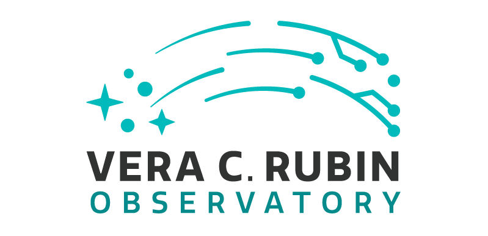
  
]

.footnote[[aboucaud@apc.in2p3.fr][mail]]
<!--  -->

[mail]: mailto:aboucaud@apc.in2p3.fr
[twitter]: https://twitter.com/alxbcd

---
exclude: true
# PDF animation replacement

.middle.center[<br><br><br><br>Animation .red[skipped] in PDF version, watch on [online slides][slides] 👈]

[slides]: https://aboucaud.github.io/slides/2022/euclid-school-ml-cycle2

---
class: middle
# Today's goal


1. Learn about useful deep learning applications for cosmology  

2. Get your hands on TensorFlow and TensorFlow Probability

3. Start playing with generative networks   

#### 

#### 
   
---

## Program overview

### .blue[This morning]
Quick introduction to deep learning and neural networks  

Convolutional neural networks

Probabilistic deep learning and generative networks

--

### .green[This afternoon]

Generating galaxies with a Variational AutoEncoder + extras

---
class: center, middle

# Disclaimer

I prepared this lecture with inputs and slides from Marc Huertas-Company

We both decided to upgrade the lecture with respect to last years' introduction so there might be a .green[continuity gap].

.red[Please do let me know] if some notions need to be explained.

---
exclude: true
<!-- class: center, middle -->
## deep learning vs. physics arXiv
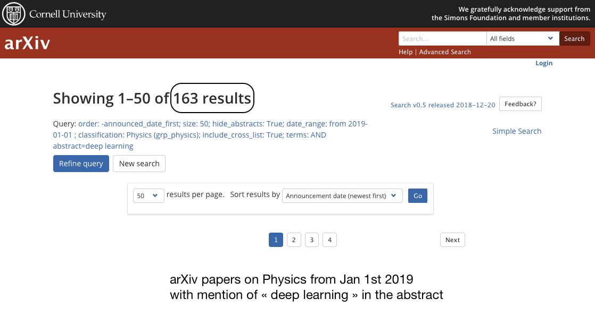

---
exclude: True
## What does "deep" means ?

.center[

]

.footnote[more on these common net architectures [here][archi]]

[archi]: https://www.jeremyjordan.me/convnet-architectures/

---
## Entering the data driven era

.center[
  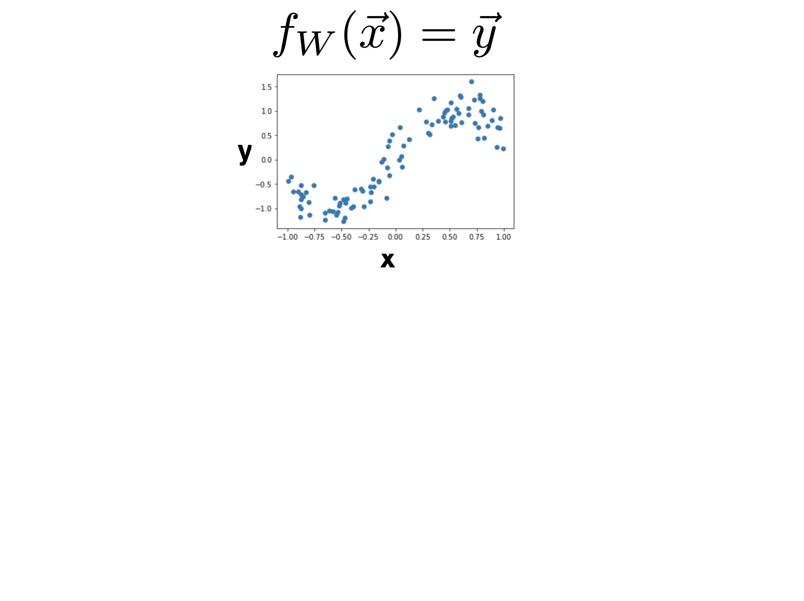
]

---
count: false
## Entering the data driven era

.center[
  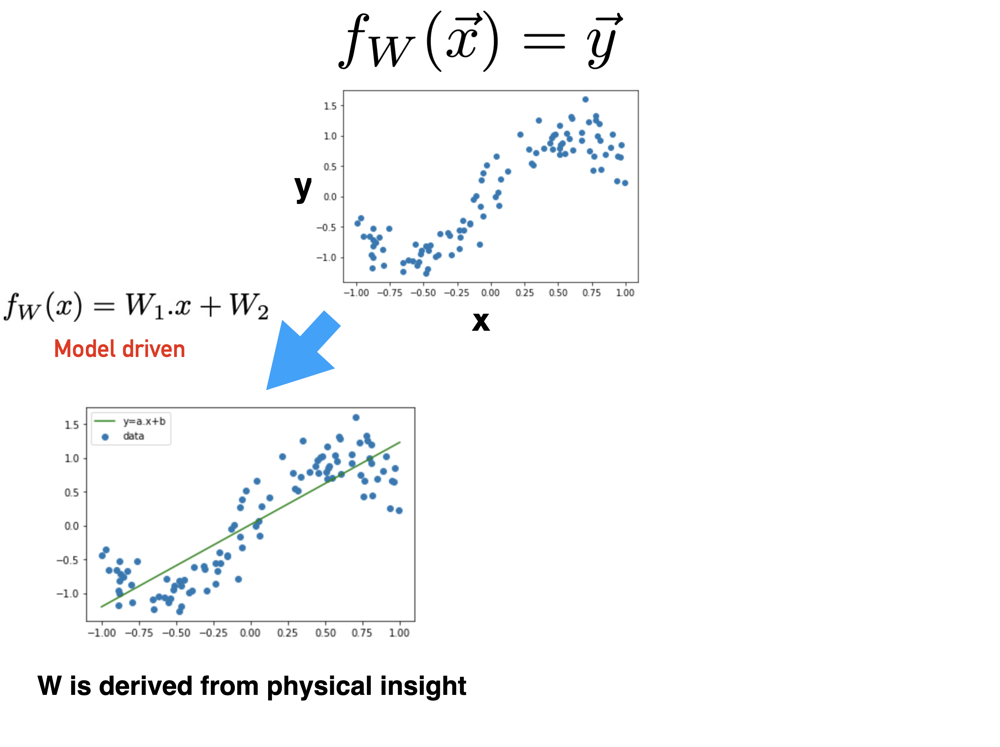
]

---
count: false
## Entering the data driven era

.center[
  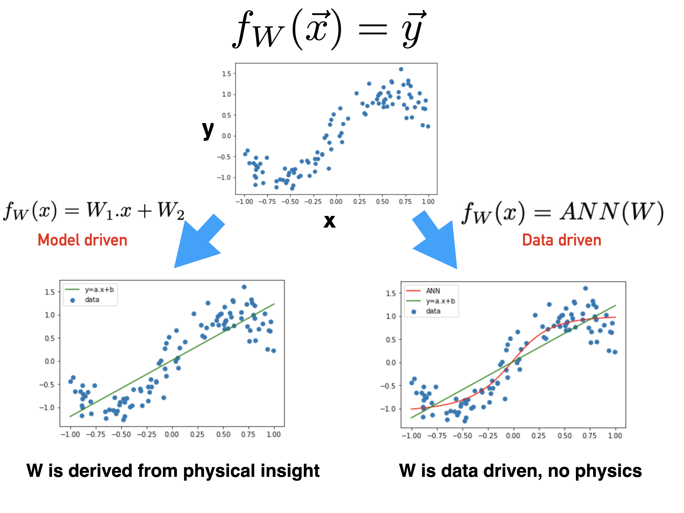
]

---
## Why data driven ?

.center[
  .medium[Physical model .green[too complex] or dataset .green[too large], leading to convergence issues] 

  .big.red[speed]
]

---
## Observed sky area vs. time

.center[<iframe width="590" height="495" src="../img/vid/hstvseuclid.mp4" title="Euclid vs HST" frameborder="0" allow="accelerometer; clipboard-write; encrypted-media; gyroscope; picture-in-picture"></iframe>]

.footnote[courtesy Jarle Brinchmann]

---
## Large imaging surveys in < 5y

.center[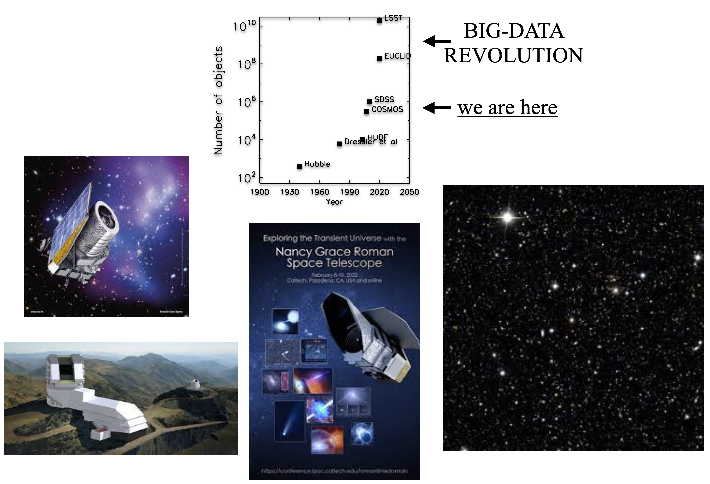]

.footnote[credit: LSST DC2 simulation]

---
## Why data driven ?

.center[
  .medium[Physical model .green[too complex] or dataset .green[too large], leading to convergence issues] 

  .big.red[speed]

  .medium[No suitable .green[physical model] available]

  .big.red[accuracy]
]

---
## Increased complexity of data

.center[]

---
## ... and simulations

.center[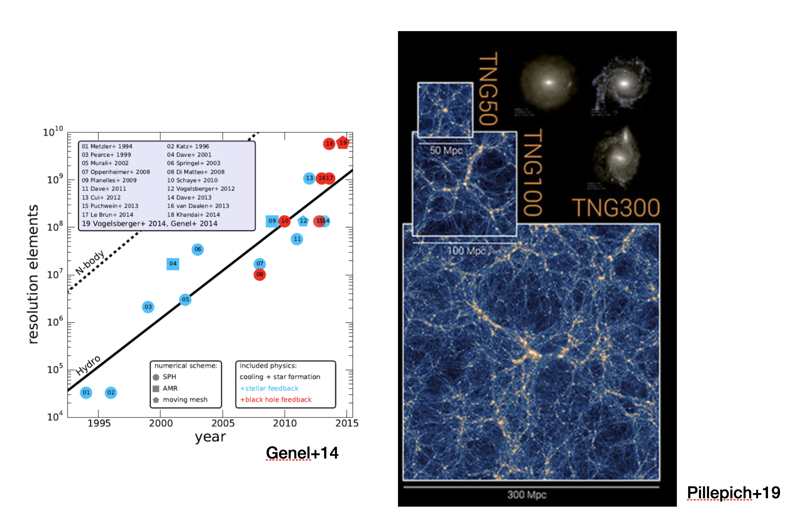]

---
## Example with Euclid

.center[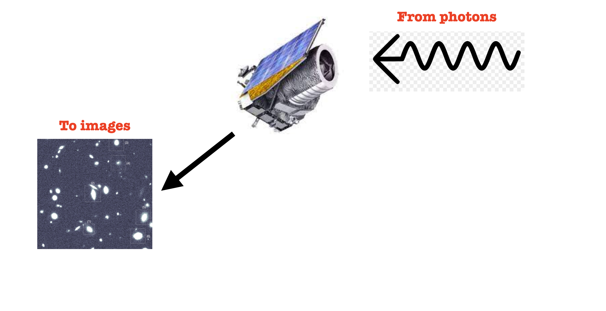]

.footnote[credit: Marc Huertas-Company]

---
count: false
## Example with Euclid

.center[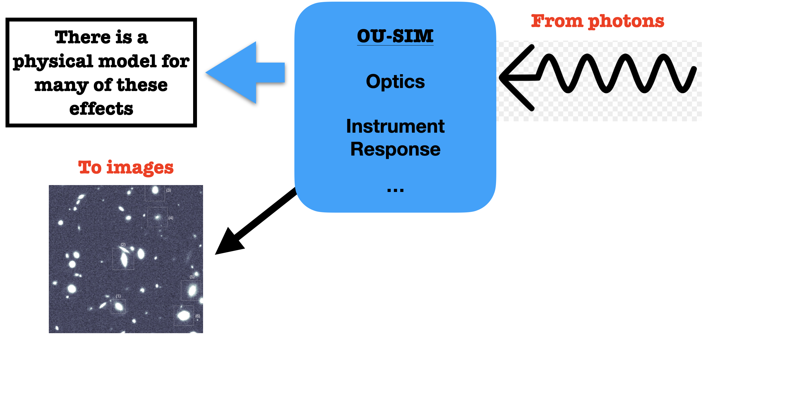]

.footnote[credit: Marc Huertas-Company]

---
count: false
## Example with Euclid

.center[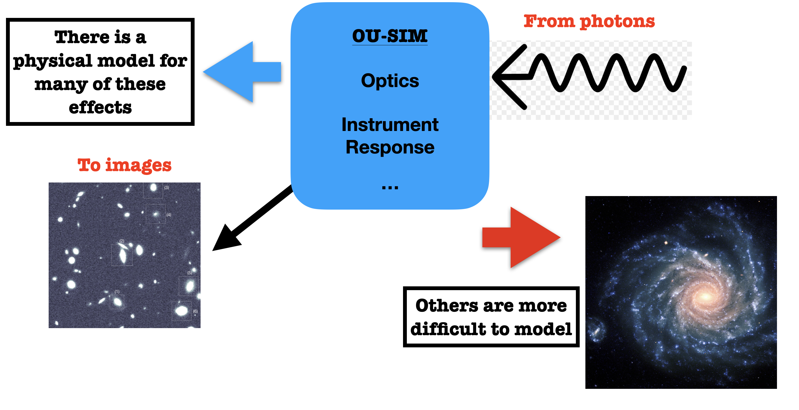]

.footnote[credit: Marc Huertas-Company]

---
## Why data driven ?

.center[
  .medium[Physical model .green[too complex] or dataset .green[too large], leading to convergence issues] 

  .big.red[speed]

  .medium[No suitable .green[physical model] available]

  .big.red[accuracy]

  .medium[There might be .green[hidden information] in the data, beyond the summary statistics we traditionally compute]
  
  .big.red[discovery]
]

---
## How can we do this ?

.center[
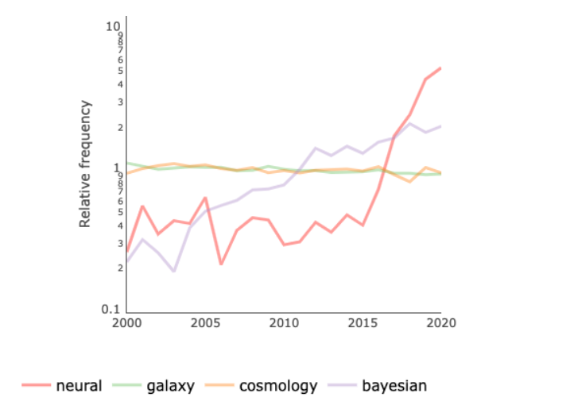
]

.footnote[Word frequency on astro-ph – Huertas-Company & Lanusse 2022]

---
## Why is ML trending ?

- .medium[specialized .blue[hardware]] .right[e.g. GPU, TPU, Intel Xeon Phi]

--
- .medium[.blue[data] availability] .right[switch to data driven algorithms]

--
- .medium[ML .blue[algorithm] research] .right[e.g. self-supervised, active learning, ...]

--
- .medium[.blue[open source] tools] .right[huge ecosystem available in a few clicks]


---
## Computational power availability
GPU architectures are .blue[excellent] for the kind of computations required by the training of NN

.center[]

| year |     hardware      | computation (TFLOPS) | price (K$) |
| ---- | :---------------: | :------------------: | :--------: |
| 2000 |  IBM ASCI White   |          12          | 100 000 K  |
| 2005 |  IBM Blue Gene/L  |         135          |  40 000 K  |
| 2021 | Nvidia Tesla A100 |        ~ 300         |   < 2 K    |

.footnote[[Wikipedia: Nvidia GPUs](https://en.wikipedia.org/wiki/List_of_Nvidia_graphics_processing_units)]

---
## CCIN2P3

.left-column[  
- GPU cluster dedicated to R&D
- .green[must request access] first
- [https://doc.cc.in2p3.fr]()

**GPU capacity**
- A100 and V100 available on queue  
=> [how to submit a job](https://doc.cc.in2p3.fr/fr/Computing/slurm/examples.html#job-gpu)
- K80 deployed on CC  
Jupyter notebook platform  
[https://notebook.cc.in2p3.fr]()


]

.right-column.center[
  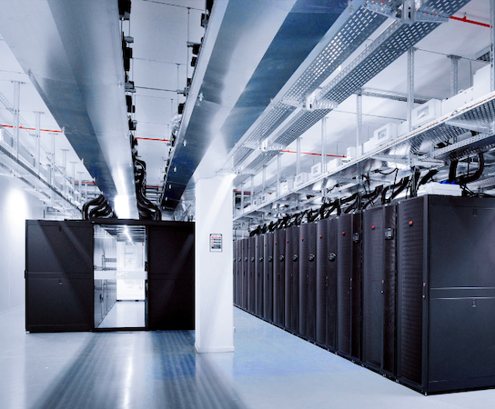  
]

.footnote[.big[powered by ]]
<!-- .bottomlogo[] -->

---
## Jean Zay

.left-column[
- French AI supercomputer  
- dedicated for public research but hosts external GPUs
- .red[must request hours] on it first  
=> see [this page](http://www.idris.fr/eng/info/gestion/demandes-heures-eng.html)
- a bit cumbersome to connect to it outside of a French lab (highly secure)
- [link to ressources](http://www.idris.fr/su/debutant.html)
]

.right-column.center[
  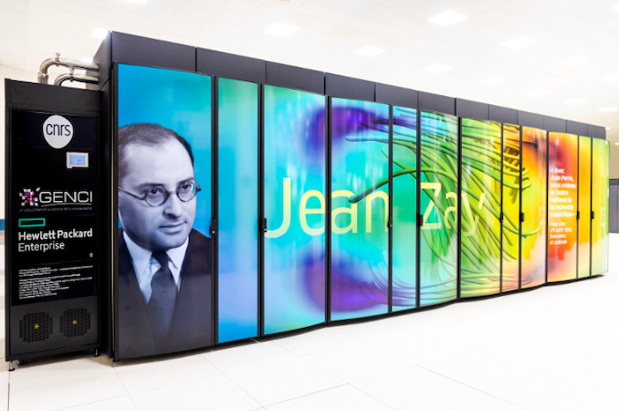  
]

.footnote[[Jean Zay presentation](http://www.idris.fr/media/ia/guide_nouvel_utilisateur_ia.pdf) (slides in French)]

---
exclude: true
## Deep learning software ecosystem

.center[
  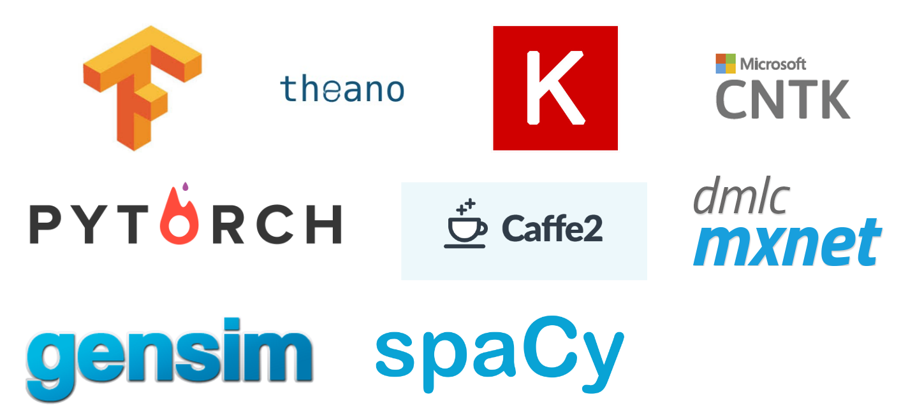
]

---
## Deep learning in the last decade

.left-column[
- translation
- image captioning
- speech synthesis
- style transfer
]

.right-column[
- cryptocurrency mining
- self-driving cars
- games 
- etc.
]

.reset-column[]
.center[
  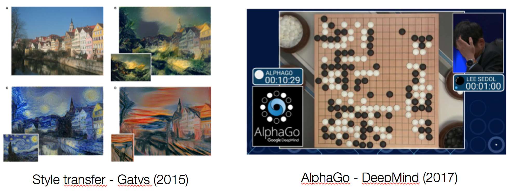
]

---
## Deep learning examples

.center[
  
]

---
## Speech analysis

.center[

]

.footnote[[WaveNet][wavenet] - TTS with sound generation - DeepMind (2017)]

[wavenet]: https://deepmind.com/blog/high-fidelity-speech-synthesis-wavenet/

---
## Image colorization

.center[

]
.center[

]

.footnote[[Real-time image colorization][deepcolor] (2017)]

[deepcolor]: https://richzhang.github.io/ideepcolor/

---
## AI for strategy games

.center[

]

.footnote[[AlphaStar][alphastar] - Starcraft II AI - DeepMind (2019)]

[alphastar]: https://deepmind.com/blog/alphastar-mastering-real-time-strategy-game-starcraft-ii/

---
## Data science ecosystem

.center[
 
]

.center[

]

.footnote[[rapids.ai][rapids] - Nvidia (2019)]

[rapids]: https://rapids.ai


---
## Advanced natural-language tasks

.center[

]

.footnote[[OpenAI - GPT-3][openai] (2020)]

[openai]: https://openai.com/api/

--
count: false

powering e.g. chatbots, Google translate, GitHub Copilot, etc.

---
## State of the art image generation

.center[
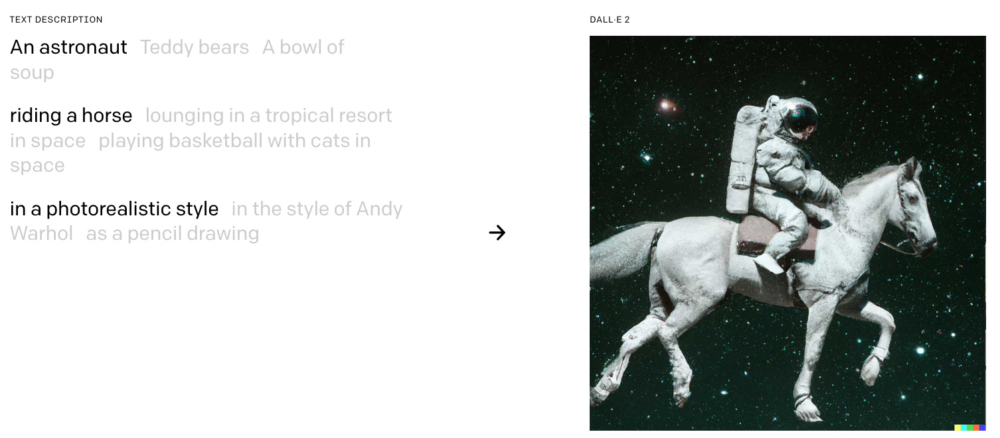
]
<!-- .singleimg[] -->

.footnote[[OpenAI - DALL•E 2][dalle2] (2022)]

[dalle2]: https://openai.com/dall-e-2/

---
## Let's take a step back

How can machine learning solve our data driven problems ?

--

Most of the time it will use a technique called .red[supervised learning]

--

...which is in essence training a .green[very flexible] .small[(non linear)] function to .green[approximate] the relationship between the (raw) data and the target task
  
- classification for .blue[discrete] output
- regression for .blue[continuous] output

---
## Supervised learning

.center[
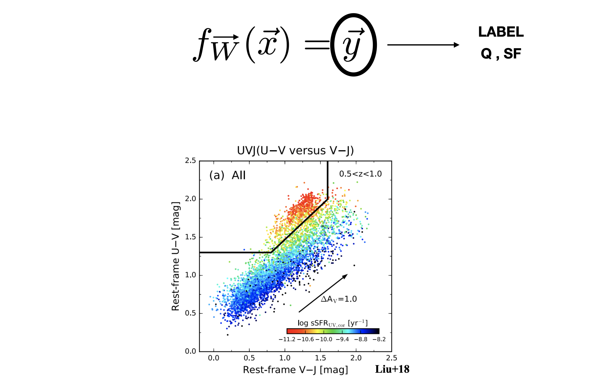
]

.footnote[credit: Marc Huertas-Company]

---
count: false
## Supervised learning

.center[
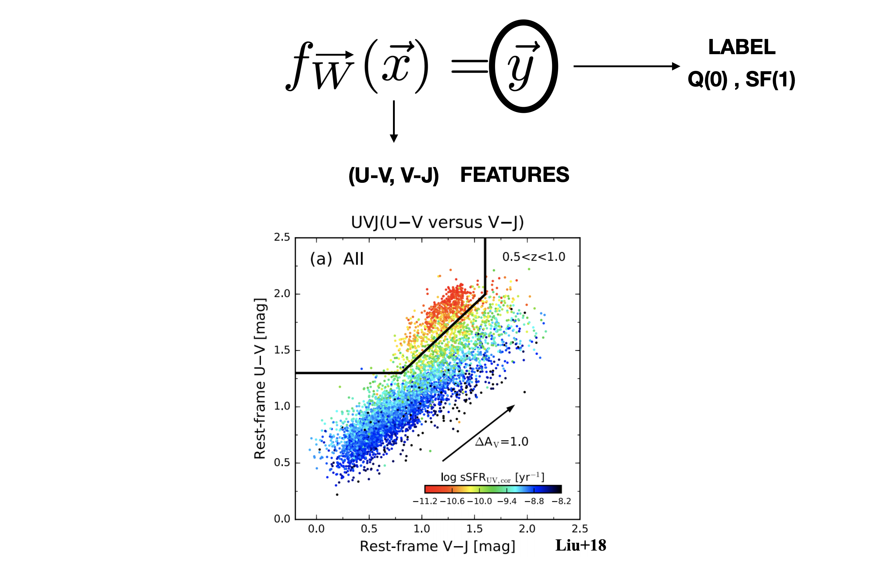
]

.footnote[credit: Marc Huertas-Company]

---
count: false
## Supervised learning

.center[
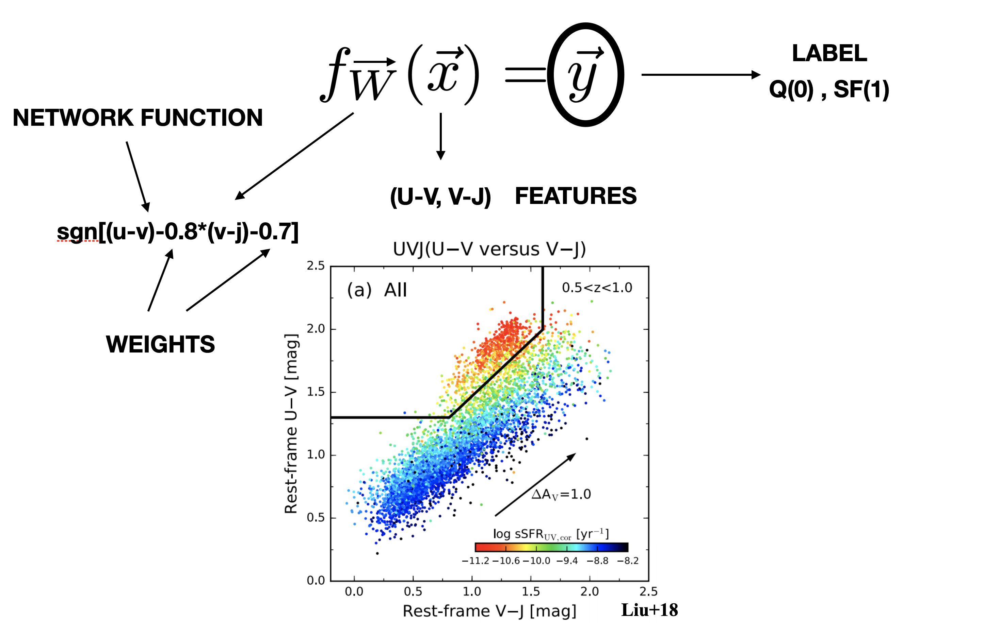
]

.footnote[credit: Marc Huertas-Company]

---
class: center, middle

There are many ML algorithms for supervised learning tasks, most of which you can find in the [scikit-learn][sklearn] library like random forests, boosted trees or support vector machines but in this lecture we will focus on the most flexible of all: .green[neural networks].

[sklearn]: https://scikit-learn.org

---
## Zoo of neural networks #1
.singleimg[]

.footnote[[Neural network zoo][nnzoo] - Fjodor van Veen (2016)]

---
## Zoo of neural networks #2

.singleimg[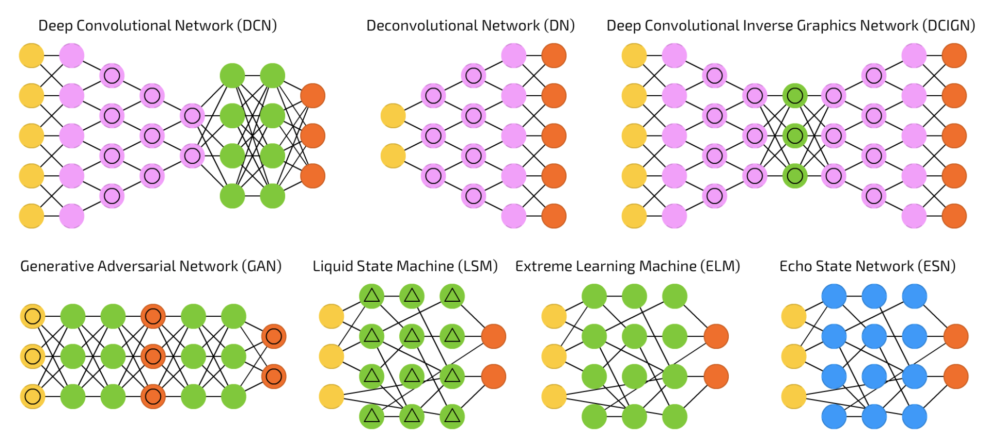]

.footnote[[Neural network zoo][nnzoo] - Fjodor van Veen (2016)]

[nnzoo]: http://www.asimovinstitute.org/neural-network-zoo/

---
exclude: true
class: center, middle

### The success of ML applications is blatant,

#### BUT

### we are still .red[far]* from "Artificial Intelligence".

.footnote[*see [nice post][mjordanmedium] by M. Jordan - Apr 2018]

[mjordanmedium]: https://medium.com/@mijordan3/artificial-intelligence-the-revolution-hasnt-happened-yet-5e1d5812e1e7 

---

# Outline

.medium[[Neural nets](#nn)]

--

.medium[[Convolutional Neural Networks (CNN)](#cnn)]

--

.medium[[Generative models](#generative)]

--

.medium[[Density estimation](#density)]

--

.medium[[Backup: common tricks and optimizations](#optim)]

---
class:middle
# Foreword: Python imports 🐍

The code snippets in these slides will use [Keras](https://keras.io) and [Tensorflow](https://tensorflow.org) (TF).  

.footnote[Keras is embedded inside TF since version 2.x.]

These snippets require some .red[preliminary Python imports] and .red[aliases] to be run beforehand.

```python
import tensorflow as tf

tfk = tf.keras
tfkl = tf.keras.layers
```

---
class: middle, center
name: nn
# What is a .red[neural network] made of ?

---
## A Neuron

A neuron is a .green[linear system] with two attributes
> the weight matrix $\mathbf{W}$  
> the linear bias $b$

It takes .green[multiple inputs] (from $\mathbf{x}$) and returns .green[a single output]
> $f(\mathbf{x}) = \mathbf{W} . \mathbf{x} + b $
.center[
  
]

---
## Linear layers

A linear layer is an .green[array of neurons].

A layer has .green[multiple inputs] (same $\mathbf{x}$ for each neuron) and returns .green[multiple outputs].

.center[
  <!--  -->
  
]

---
## Hidden layers

All layers internal to the network (not input or output layer) are considered .green[hidden layers].

.center[]

.footnote[[cs231n.github.io](http://cs231n.github.io/)]

---
## Multi-layer perceptron (MLP)


.left-column[
```python
# initialize model
model = tfk.Sequential()

# add layers
model.add(tfkl.Dense(4, input_dim=3))
model.add(tfkl.Dense(4))
model.add(tfkl.Dense(1))
```
]

.right-column[

]

---
count: false
## Multi-layer perceptron (MLP)
.left-column[
```python
# initialize model
model = tfk.Sequential()

# add layers
model.add(tfkl.Dense(4, input_dim=3))
model.add(tfkl.Dense(4))
model.add(tfkl.Dense(1))
```
]
.right-column[

]

.hidden[aa]
.reset-column[]
.center[
.huge[QUESTION:]</br></br>
.big[How many .red[free parameters] has this model ?]
]

---
count: false
## Multi-layer perceptron (MLP)
.left-column[
```python
model = tfk.Sequential()

model.add(tfkl.Dense(4, input_dim=3))
model.add(tfkl.Dense(4))
model.add(tfkl.Dense(1))

# print model structure
model.summary()
```
]
.right-column[

]
.reset-column[
```
__________________________________________________
Layer (type)          Output Shape        Param #
==================================================
dense_1 (Dense)       (None, 4)           16         <=   W (3, 4)   b (4, 1)
__________________________________________________
```
]

---
count: false
## Multi-layer perceptron (MLP)
.left-column[
```python
model = tfk.Sequential()

model.add(tfkl.Dense(4, input_dim=3))
model.add(tfkl.Dense(4))
model.add(tfkl.Dense(1))

# print model structure
model.summary()
```
]
.right-column[

]
.reset-column[
```
__________________________________________________
Layer (type)          Output Shape        Param #
==================================================
dense_1 (Dense)       (None, 4)           16
__________________________________________________
dense_2 (Dense)       (None, 4)           20         <=   W (4, 4)   b (4, 1)
__________________________________________________
```
]

---
count: false
## Multi-layer perceptron (MLP)
.left-column[
```python
model = tfk.Sequential()

model.add(tfkl.Dense(4, input_dim=3))
model.add(tfkl.Dense(4))
model.add(tfkl.Dense(1))

# print model structure
model.summary()
```
]
.right-column[

]
.reset-column[
```
__________________________________________________
Layer (type)          Output Shape        Param #
==================================================
dense_1 (Dense)       (None, 4)           16
__________________________________________________
dense_2 (Dense)       (None, 4)           20
__________________________________________________
dense_3 (Dense)       (None, 1)           5          <=   W (4, 1)   b (1, 1)
==================================================
Total params: 41
Trainable params: 41
Non-trainable params: 0
```
]

---
exclude: True

## Multi-layer perceptron (MLP)

```python
# initialize model
model = tfk.Sequential()

# add layers
model.add(tfkl.Dense(4, input_dim=3))
model.add(tfkl.Dense(4))
model.add(tfkl.Dense(1))
```

--
exclude: True
```python
# print model structure
model.summary()
```

--
exclude: True
```bash
_________________________________________________________________
Layer (type)                 Output Shape              Param #
=================================================================
dense_1 (Dense)              (None, 4)                 16
_________________________________________________________________
dense_2 (Dense)              (None, 4)                 20
_________________________________________________________________
dense_3 (Dense)              (None, 1)                 5
=================================================================
Total params: 41
Trainable params: 41
Non-trainable params: 0
```

---
name: activation
## Adding non linearities

A network with several linear layers remains a .green[linear system].

--

To add non-linearities to the system, .red[activation functions] are introduced. 

.center[]

---
count: false
## Adding non linearities

A network with several linear layers remains a .green[linear system].

To add non-linearities to the system, .red[activation functions] are introduced. 

.center[]

.footnote[credit: Alexander Chekunkov]

---
## Activation functions 

.center[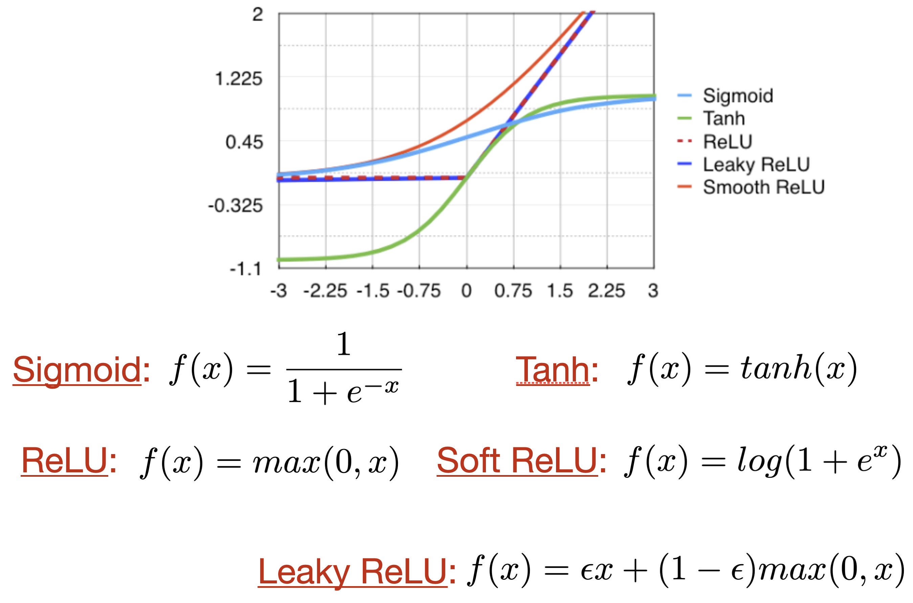]


---
## Activation layer

There are two different syntaxes whether the activation is seen as a .green[property] of the neuron layer

```python
model = tfk.Sequential()
model.add(tfkl.Dense(4, input_dim=3, activation='sigmoid'))
```

--

or as an .green[additional layer] to the stack

```python
model = tfk.Sequential()
model.add(tfkl.Dense(4, input_dim=3))
model.add(tfkl.Activation('tanh'))
```

--
The activation layer .red[does not add] any .red[depth] to the network.

---
## Simple network


One neuron, one activation function.


.center[]

$$x \overset{neuron}\longrightarrow z(x) = wx + b\overset{activation}\longrightarrow g(z(x)) = y$$


---
## Supervised training

In .red[supervised learning], we train a neural network $f_{\vec w}$ with a set of weights $\vec w$ to approximate the target $\vec y$ (label, value) from the data $\vec x$ such that

$$f_{\vec w}(\vec x) = \vec y$$

For this simple network we have 

$$f_{\vec w}(x) = g(wx + b)\quad \text{with} \quad {\vec w} = \\{w, b\\}$$

In order to optimize the weight $\vec w$, we need to select a loss function $\ell$ depending on the category of problem and .red[minimize it with respect to the weights].

---
## Loss functions

Here are the most traditional loss functions.

.blue[**Regression**] : mean square error

$$\text{MSE} = \frac{1}{N}\sum_i\left[y_i - f_w(x_i)\right]^2$$

.blue[**Classification**] : binary cross-entropy

$$\text{BCE} = -\frac{1}{N}\sum_i y_i\cdot\log\ f_w(x_i) + (1-y_i)\cdot\log\left(1-f_w(x_i)\right)$$

---
## Minimizing the loss

To optimize the weights of the network, we use an iterative procedure, based on gradient descent, that minimizes the loss. 

--

For this to work, we need to be able to express the gradients of the loss $\ell$ with respect to any of the weight of the network.

In our single neuron example, we need
$$ \dfrac{\partial \ell}{\partial w} \quad \text{and} \quad \dfrac{\partial \ell}{\partial b} $$

--
Can we compute these gradients easily ?

---
name: backprop
## Backpropagation

A .green[30-years old] algorithm (Rumelhart et al., 1986)

which is .red[key] for the re-emergence of neural networks today.

.center[]

.footnote[credit: Alexander Chekunkov]

---
## Chain rule

Backpropagation works if networks are .green[differentiable].

.red[Each layer] must have an analytic derivative expression.

$$ x \overset{neuron}\longrightarrow z(x) = wx + b\overset{activation}\longrightarrow g(z(x)) = y$$

--
Since $w$ and $b$ are also variables
$$ z(x, w, b) = wx + b\,, $$
the gradients can be expressed as
$$ \dfrac{\partial z}{\partial x} = w\,, \quad \dfrac{\partial z}{\partial w} = x \quad\text{and}\quad \dfrac{\partial z}{\partial b} = 1\,. $$
---
count:false
## Chain rule

Backpropagation works if networks are .green[differentiable].

.red[Each layer] must have an analytic derivative expression.

$$ x \overset{neuron}\longrightarrow z(x) = wx + b\overset{activation}\longrightarrow g(z(x)) = y$$

Then the .red[chain rule] can be applied :

$$ \dfrac{\partial \ell}{\partial w} =
   \dfrac{\partial \ell}{\partial g} \cdot 
   \dfrac{\partial g}{\partial z} \cdot 
   \dfrac{\partial z}{\partial w} = \nabla \ell(y) \cdot g'(z) \cdot x $$
and
$$ \dfrac{\partial \ell}{\partial b} =
   \dfrac{\partial \ell}{\partial g} \cdot 
   \dfrac{\partial g}{\partial z} \cdot 
   \dfrac{\partial z}{\partial b} = \nabla \ell(y) \cdot g'(z)$$

---
## Network with more layers

Let's add one layer (with a single neuron) with the .green[same] activation $g$
<!-- $$ x \longrightarrow z_1 = w_1x + b_1\longrightarrow a_1 = g(z_1(x)) \downarrow$$ -->
<!-- $$  y = a_2 = g(z_2(x)) \longleftarrow z_2 = w_2a_1 + b_2$$ -->
$$ x \longrightarrow z_1 = w_1x + b_1\longrightarrow a_1 = g(z_1(x)) \rightarrow$$
$$ \rightarrow z_2 = w_2a_1 + b_2 \longrightarrow a_2 = g(z_2(x)) = y $$
--
.center.red[How do we compute the gradients of $w_1$ : $\dfrac{\partial\ell}{\partial w_1}$ ?]
--
.footnote[Hint: remember the algorithm is called .green[backpropagation]]

---
## Network with more layers

Let's add one layer (with a single neuron) with the .green[same] activation $g$
<!-- $$ x \longrightarrow z_1 = w_1x + b_1\longrightarrow a_1 = g(z_1(x)) \rightarrow$$
$$ \rightarrow z_2 = w_2a_1 + b_2 \longrightarrow a_2 = g(z_2(x)) = y $$ -->
$$ x \longrightarrow z_1 = w_1x + b_1\longrightarrow a_1 = g(z_1(x)) \rightarrow$$
$$ \rightarrow z_2 = w_2a_1 + b_2 \longrightarrow a_2 = g(z_2(x)) = y $$
We use the .red[chain rule]

$$ \dfrac{\partial \ell}{\partial w_1} =
   \dfrac{\partial \ell}{\partial a_2} \cdot 
   \dfrac{\partial a_2}{\partial z_2} \cdot 
   \dfrac{\partial z_2}{\partial a_1} \cdot 
   \dfrac{\partial a_1}{\partial z_1} \cdot 
   \dfrac{\partial z_1}{\partial w_1} $$
--
which simplifies to

$$ \dfrac{\partial \ell}{\partial w_1} =
   \nabla \ell(y) \cdot 
   g'(z_2) \cdot 
   w_2 \cdot 
   g'(z_1) \cdot 
   x $$
   <!-- = \dfrac{\partial \ell}{\partial a} \cdot g'(z) \cdot x $$ -->

---
## Network with more layers

From the latest expression

$$ \dfrac{\partial \ell}{\partial w_1} =
   \left(
     \nabla \ell(y) \cdot 
     g'(z_2) \cdot 
     w_2 \right)\cdot 
   g'(z_1) \cdot 
   x $$

one can derive the algorithm to compute .green[the gradient for a layer] $z_i$
$$ \dfrac{\partial \ell}{\partial z_i} =
\left(
\left(\nabla \ell(y) \cdot 
  g'(z_n) \cdot 
  w_n \right) \cdot 
  g'(z^{n-1}) * w^{n-1}\right)
  [\dots]  \cdot g'(z_i) $$

which can be re-written as .red[a recursion]

$$ \dfrac{\partial \ell}{\partial z_i} = \dfrac{\partial \ell}{\partial z^{i+1}} \cdot w^{i+1} \cdot g'(z_i) $$

--
.footnote[find a clear and more detailed explaination of backpropagation [here](https://www.jeremyjordan.me/neural-networks-training/)]

---
## Loss and optimizer

Once your architecture (`model`) is ready, the [loss function](https://keras.io/losses/) and an [optimizer](https://keras.io/optimizers/) .red[must] be specified 
```python
model.compile(optimizer='adam', loss='mse')
```
or using specific classes for better access to optimization parameters
```python
model.compile(optimizer=tfk.optimizers.Adam(lr=0.01, decay=0.1), 
              loss='mse')
```

Choose both according to the data and target output.

.footnote[[Nice lecture](https://mlelarge.github.io/dataflowr-slides/X/lesson4.html) on optimizers]

---
## Network update

1. feedforward and compute loss gradient on the output
$$ \nabla \ell(f_{\vec w}(\vec x)) $$

2. for each layer in the backward direction, 
  * .blue[receive] the gradients from the previous layer, 
  * .blue[compute] the gradient of the current layer
  * .blue[multiply] with the weights and .blue[pass] the results on to the next layer

3. for each layer, update their weight and bias using their own gradient, following the optimisation scheme (e.g. gradient descent)

---
## Training

It's time to .green[train] your model on the data (`X_train`, `y_train`). 

```python
model.fit(X_train, y_train,
          batch_size=32,        
          epochs=50,  
          validation_split=0.3) # % of data being used for val_loss evaluation

```

- **`batch_size`**: .green[\# of images] used before updating the model<br/>
  32 is a very good compromise between precision and speed*
- **`epochs`**: .green[\# of times] the model is trained with the full dataset

After each epoch, the model will compute the loss on the validation set to produce the **`val_loss`**. 

.red[The closer the values of **`loss`** and **`val_loss`**, the better the training]. 

.footnote[*see [Masters et al. (2018)](https://arxiv.org/abs/1804.07612)]

---
## Training

It's time to .green[train] your model on the data (`X_train`, `y_train`). 

```python
model.fit(X_train, y_train,
          batch_size=32,        
          epochs=50,  
          validation_split=0.3) # % of data being used for val_loss evaluation

```

- **`batch_size`**: .green[\# of images] used before updating the model<br/>
  32 is a very good compromise between precision and speed*
- **`epochs`**: .green[\# of times] the model is trained with the full dataset

After each epoch, the model will compute the loss on the validation set to produce the **`val_loss`**. 

.red[The closer the values of **`loss`** and **`val_loss`**, the better the training]. 

.footnote[*see [Masters et al. (2018)](https://arxiv.org/abs/1804.07612)]

---
## Monitoring the training loss

```python
import matplotlib.pyplot as plt

history = model.fit(X_train, y_train, epochs=500, validation_split=0.3)  

# Visualizing the training                    
plt.plot(history.history['loss'], label='train')
plt.plot(history.history['val_loss'], label='validation')
plt.xlabel('epochs'); plt.ylabel('loss'); plt.legend()
```

.center[]

---
## What to expect

The training must be stopped when reaching the .green[sweet spot]  
.small[(i.e. before .red[overfitting])].

.center[]

---
## Learning rate

Must be chosen carefully

.center[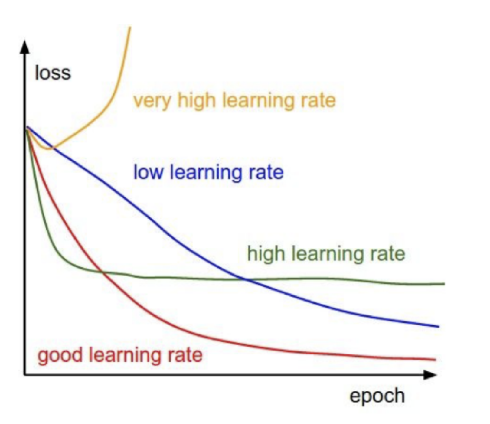]

---
## Callbacks

[Callbacks](https://keras.io/api/callbacks/) are methods that act on the model during training, e.g.

```python
# Save the weights of the model based on lowest val_loss value
chkpt = tfk.callbacks.ModelCheckpoint('weights.h5', save_best_only=True)
# Stop the model before 50 epochs if stalling for 5 epochs
early = tfk.callbacks.EarlyStopping(patience=5)

model.fit(X_train, y_train,
          epochs=50,
          callbacks=[chkpt, early])
```
--
- `ModelCheckpoint` saves the weights locally
  ```python
  model.load_weights('weights.h5')  # instead of model.fit()
  ```
- Many other interesting callbacks such as   
  `LearningRateScheduler`, `TensorBoard` or `TerminateOnNaN`

---
exclude: true
## Tensorboard

Use this callback to monitor your training live and compare the training of your models.

.center[]

.footnote[credit: [Edward Tensorboard tuto](http://edwardlib.org/tutorials/tensorboard)]

---
exclude: true
## Multi-layer perceptron

The .green[classical] neural network, with an input vector $X_i$ where $i$ is the sample number.

.center[]

.footnote[[cs231n.github.io](http://cs231n.github.io/)]

---
## Typical architecture of a FCN

| parameter                |                    typical value |
| ------------------------ | -------------------------------: |
| input neurons            |            one per input feature |
| output neurons           |     one per prediction dimension |
| hidden layers            | depends on the problem (~1 to 5) |
| neurons in hidden layers |                       ~10 to 1e3 |
| loss function            |      MSE or binary cross-entropy |
| hidden activation        |                             ReLU |
| output activation        |                        see below |
    
| output activation |                  typical problem |
| ----------------- | -------------------------------: |
| `None`            |                       regression |
| `softplus`        |                 positive outputs |
| `softmax`         |        multiclass classification |
| `sigmoid/tanh`    | bounded outputs / classification |

---
## From ML to deep learning

Letting the network discover the most appropriate way to extract features from the raw data

.center[
  
]

---
## Questions

.big[
How do you feed an image to a FCN?]
<br/>
.center[
  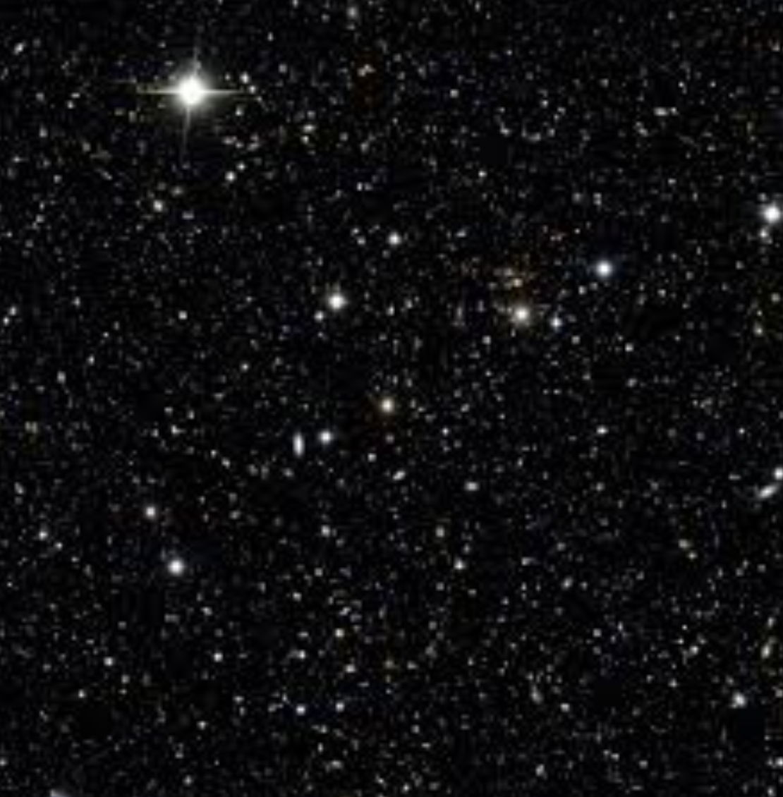
]

--
.big[
What issues would that create?
]

---
class: middle, center
name: cnn

# .red[Convolutional] Neural Networks

---
## Convolution in 1D

.center[<iframe width="560" height="315" src="../img/vid/1d-conv.mp4" title="YouTube video player" frameborder="0" allow="accelerometer; autoplay; clipboard-write; encrypted-media; gyroscope; picture-in-picture" allowfullscreen></iframe>]

.footnote[[credit](https://www.youtube.com/watch?v=ulKbLD6BRJA)]

---
## Convolution in 2D

.center[]

.footnote[[arXiv:1603.07285](https://arxiv.org/abs/1603.07285)]

---
## Unrolling convolutions

.center[
  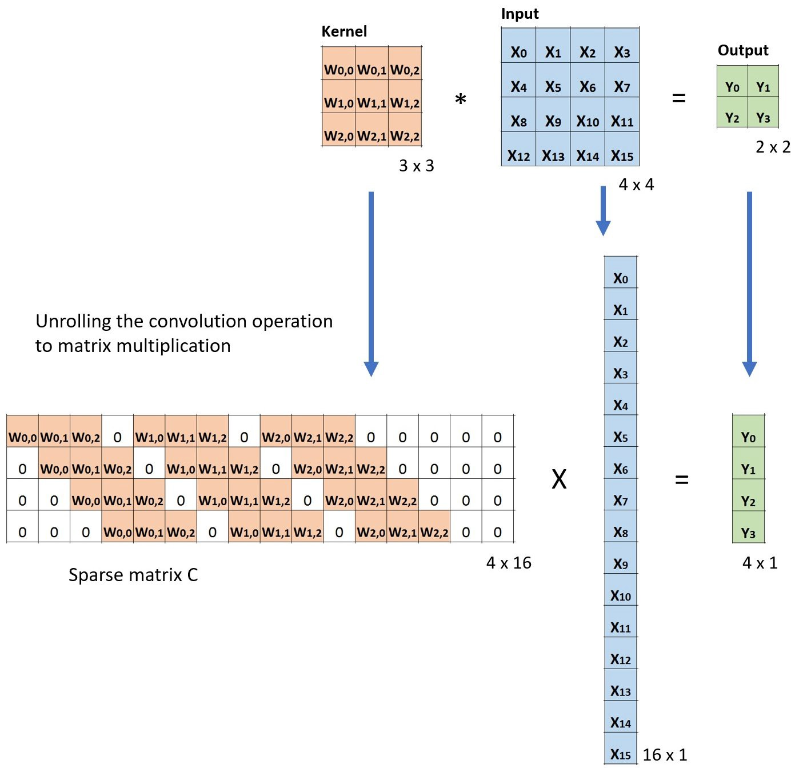
]

.footnote[[credit](https://ychai.uk/notes/2019/08/28/NN/go-deeper-in-Convolutions-a-Peek/)]


---

## Convolutional Neural Networks


- succession of .blue[convolution and downsampling layers]  
  .small[(with some dense layers at the end)]
- the training phase tunes the .green[convolution kernels]
- each kernel is applied on the entire image/tensor at each step   
  => .red[preserves translational invariance]

.center[
  
]

---
## Convolution layers

.left-column[
```python
model = tfk.Sequential()
  # First conv needs input_shape
model.add(
  tfkl.Conv2D(
    15,              # filter size 
    (3, 3),          # kernel size
    strides=1,       # default
    padding='valid', # default
    input_shape=(32, 32, 3)))
  # Next layers don't
model.add(
  tfkl.Conv2D(16, (3, 3), strides=2))
model.add(tfkl.Conv2D(32, (3, 3)))
```
]

.right-column[

] 

.reset-columns[
  <br> <br> <br> <br/> <br/> <br/> <br> <br> <br> <br> 
- **kernel properties**: .green[size] and number of .green[filters]
- **convolution properties**: .green[strides] and .green[padding]
- output shape depends on .red[**all**] these properties
]

---
## Convolution layer operations

.left-column[
- each input .blue[image channel] is convolved with a kernel
- the convoluted channels are summed element-wise to produce .green[output images]
- the same operation is repeated here 3 times
- the final output is a concatenation of the intermediate .green[output images]
]

.right-column[
  .singleimg[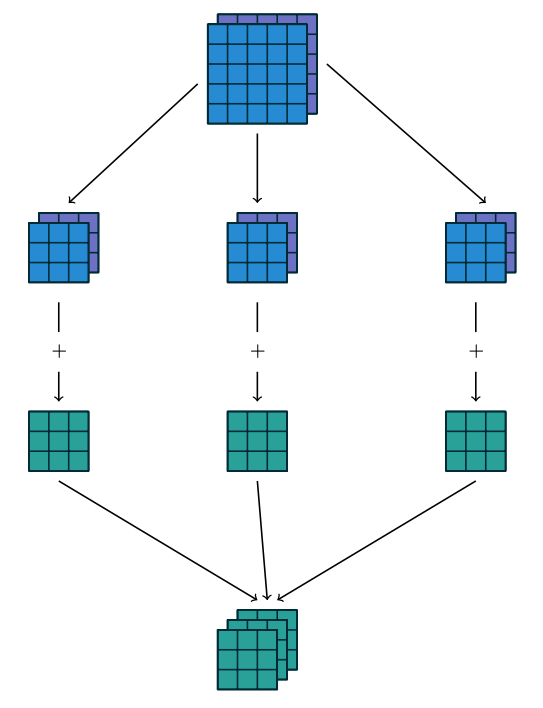]
]

---
## No strides, no padding

.left-column[
```python
model = tfk.Sequential()
model.add(
  tfkl.Conv2D(
    filters=1, 
    kernel_size=(3, 3), 
    strides=1,               # default
    padding='valid',         # default
    input_shape=(7, 7, 1)))
```
```python
model.summary()
```

```
_________________________________________
Layer (type)            Output Shape     
=========================================
conv2d (Conv2D)         (None, 5, 5, 1)  
=========================================
Total params: 10
Trainable params: 10
Non-trainable params: 0
_________________________________________
```
] 
.right-column[

] 


.footnote[[arXiv:1603.07285](https://arxiv.org/abs/1603.07285)]
---
## Strides (2,2) + padding

.left-column[
```python
model = tfk.Sequential()
model.add(
  tfkl.Conv2D(
    1, 
    (3, 3), 
*   strides=2, 
    padding='same', 
    input_shape=(5, 5, 1)))
```
```python
model.summary()
```

```
_________________________________________
Layer (type)            Output Shape     
=========================================
conv2d (Conv2D)         (None, 3, 3, 1)  
=========================================
Total params: 10
Trainable params: 10
Non-trainable params: 0
_________________________________________
```
]
.right-column[ 

]

.footnote[[arXiv:1603.07285](https://arxiv.org/abs/1603.07285)]

---
## Why downsampling ?

We just saw a convolution layer using a strides of 2, which is the equivalent of taking every other pixel from the convolution.  

This naturally downsamples the image by a factor of ~2*
.footnote[padding plays a role to adjust the exact shape].

There are .green[two main reasons] for downsampling the images

1. it .red[reduces the size] of the tensors .red[progressively] (i.e. until they can be passed to a dense network)
2. it allows the fixed-size kernels to explore .blue[larger scale correlations]  
  phenomenon also know as .red[increasing the *receptive field*] of the network

There are other ways of downsampling the images.

---
## Pooling layers

- common methods: **`MaxPooling`** or **`AvgPooling`**
- common strides: (2, 2)
- pooling layers do not have free parameters

.center[
  
]
.footnote[[cs231n.github.io](http://cs231n.github.io/)]

---
## Pooling layers

.left-column[
```python
model = tfk.Sequential()
model.add(
  tfkl.Conv2D(
    1, (3, 3), 
    strides=1, 
    padding='same', 
    input_shape=(8, 8, 1)))
model.add(tfkl.MaxPool2D((2, 2)))
```

```python
model.summary()
```

```
__________________________________________________
Layer (type)          Output Shape        Param #
==================================================
conv2d_1 (Conv2D)     (None, 8, 8, 1)     10
__________________________________________________
max_pooling2d_1 (MaxP (None, 4, 4, 1)     0
==================================================
Total params: 10
Trainable params: 10
Non-trainable params: 0
__________________________________________________
```
]
.right-column[ 
  
]

---
## Activation

.left-column[
```python
model = tfk.Sequential()
model.add(
  tfkl.Conv2D(
    1, (3, 3), 
*   activation='relu'
    input_shape=(5, 5, 1)))
```
]

.right-column[ 

]

.reset-columns[
  </br>
  </br>
  </br>
  </br>
  </br>
  </br>
- safe choice*: use .red[ReLU or [variants](https://homl.info/49)] (PReLU, [SELU](https://homl.info/selu), LeakyReLU) for the convolutional layers
- select the activation of the .red[last layer] according to your problem
.small[e.g. sigmoid for binary classification]
]
- checkout the available activation layers [here](https://keras.io/api/layers/activation_layers/)

<!-- .footnote[*not been proven (yet) but adopted empirically] -->
---
class: center, middle
# Convnets

---
## Convnets aka CNNs

Use of convolution layers to go from images / spectra to floats (summary statistics) for classification or regression

.center[
  
]

They had a .green[huge success] in 2017-2020

---
## Classification of strong lenses

.center[
  
]

---
count: false
## Classification of strong lenses

.center[
  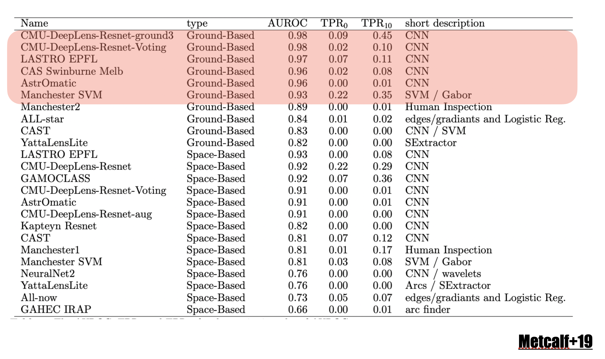
]

---

## Photometric redshifts

.center[
  
]

---
## Cosmological field constraints

.center[
  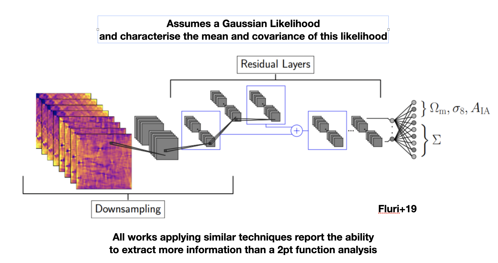
]

---
class: center, middle
# Image2Image networks

### a.k.a. feature extractors

---
## Full convolutional networks FCN

They provide a way to recover the original shape of the input tensors through .green[transposed convolutions]

.center[
  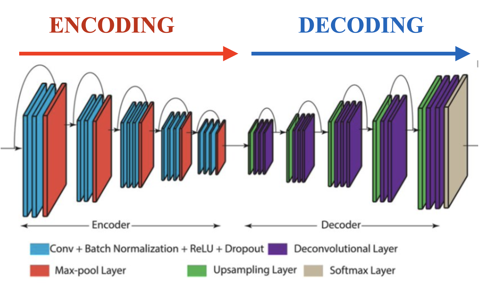
]

---
## Transpose convolutions

.center[
  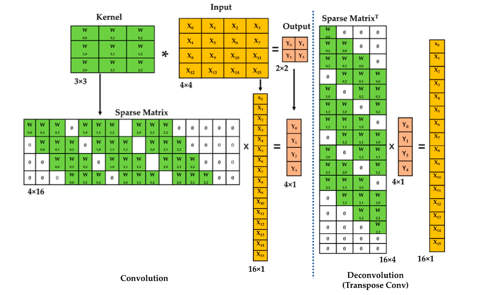
]

.footnote[[credit](https://www.mdpi.com/1424-8220/19/19/4251)]

---
## Auto encoders

Efficient way of doing non-linear dimensionality reduction through a compression (encoding) in a low dimensional space called the .red[latent space] followed by a reconstruction (decoding).

.center[
  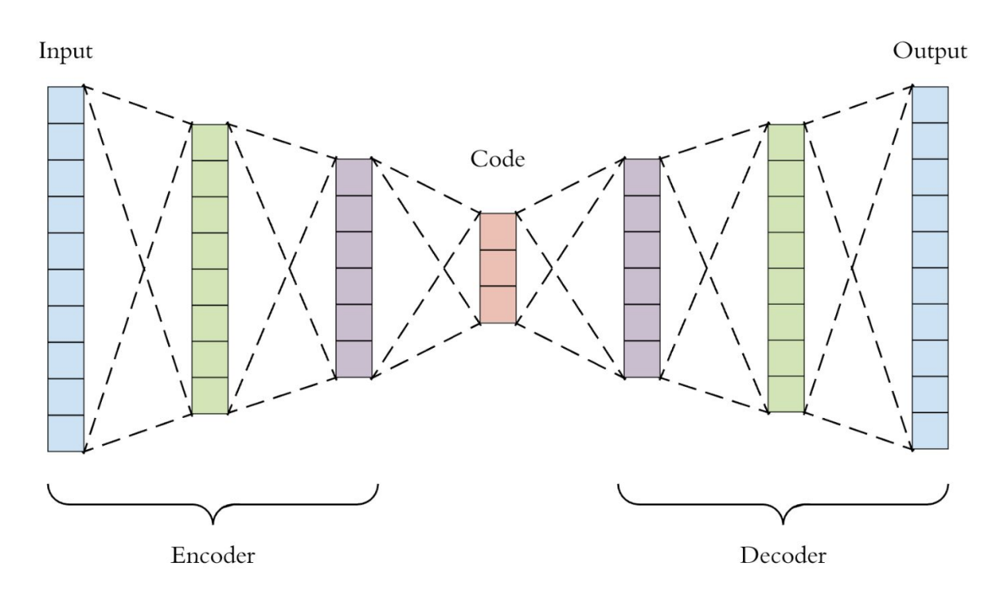
]

---
## Auto encoders

.center[
  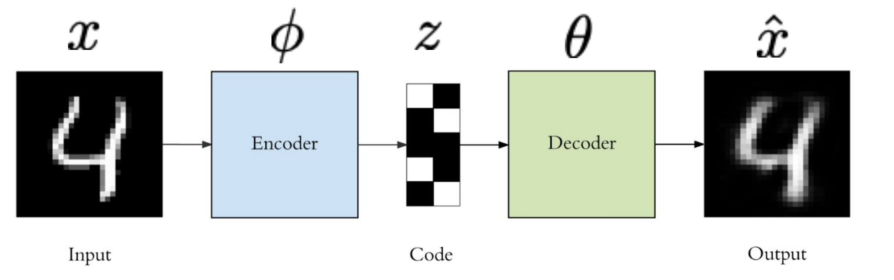
]

.big.center[👉 cf. demo in Jupyter notebook]

---
## Feature extraction in images

Here segmentation of overlapping galaxies

.center[
  
]

.footnote[Boucaud+19]

---
## Probabilistic segmentation

Same but with captured "uncertainty"

.center[
  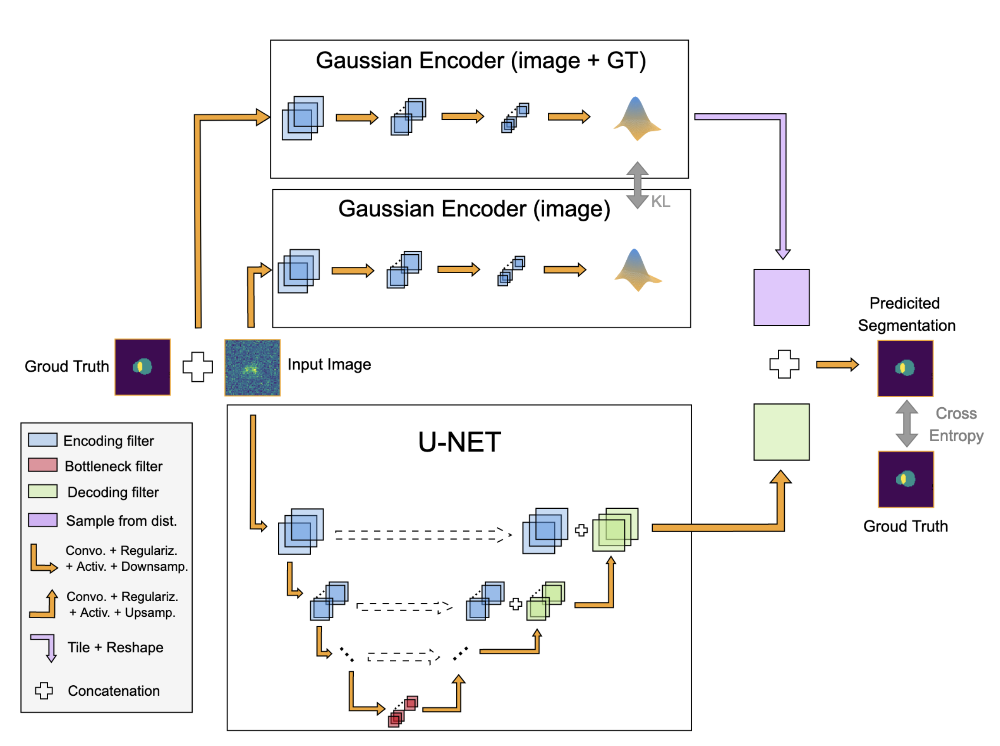
]

.footnote[Bretonnière+21]

---
## Accelerating N-Body sims

Capturing the displacement of particules

.center[
  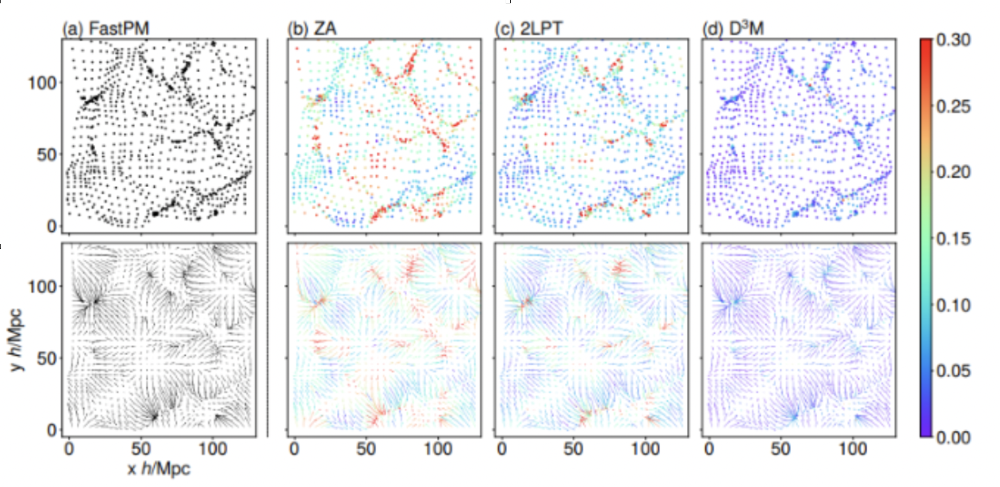
]

.footnote[He+18]

---
## 3D simulations

Finding dark matter halos in density fields

.center[
  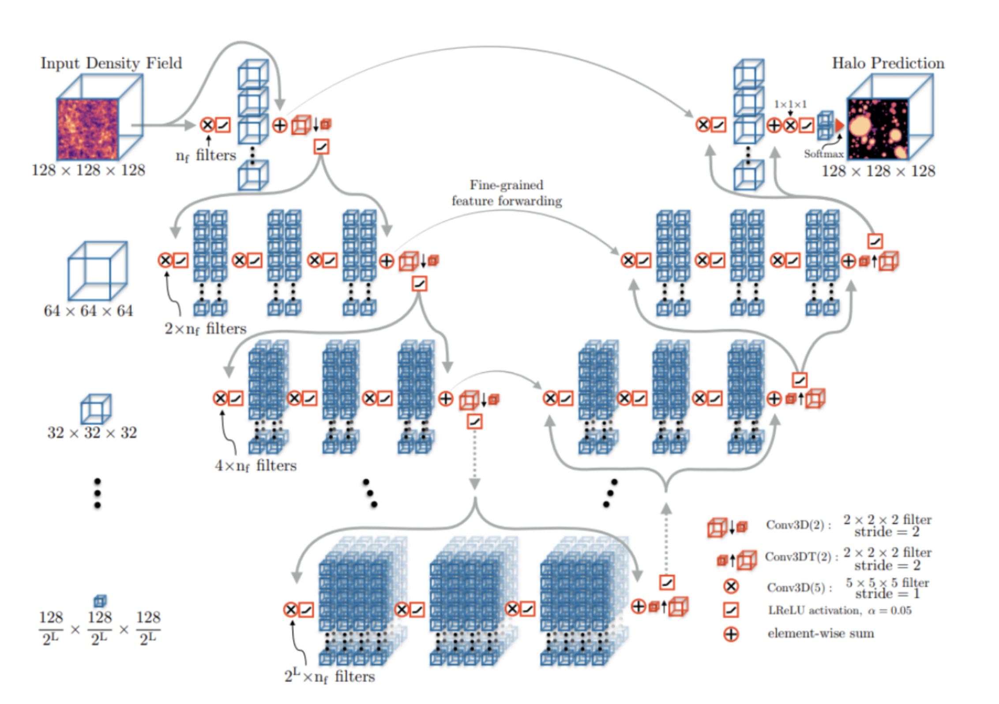
]

.footnote[Berger&Stein+18]

---
class: center, middle
name: generative

# .red[Generative] models

---
class: center, middle

# Variational Auto Encoders

---
## VAE

Principle is simple: replace the deterministic latent space with a multivariate distribution.

.center[
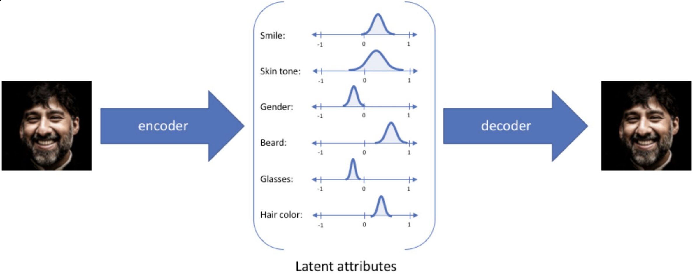
]

This ensures that .red[close points] in latent space lead to .red[the same reconstruction].

.footnote[[Kingma & Welling 2014](https://arxiv.org/abs/1312.6114)]

---
## Imposing structure

Adding to the loss term a Kullback-Leibler (KL) divergence term regularizes the structure of the latent space.

.center[<iframe width="540" height="335" src="../img/vid/dkl_2.mp4" title="Justine KL explanation" frameborder="0" allow="accelerometer; clipboard-write; encrypted-media; gyroscope; picture-in-picture" allowfullscreen></iframe>]
---
## Reparametrisation trick

Making sure once can .green[backpropagate] through the network even when one of the nodes is .blue[non-deterministic].

.center[
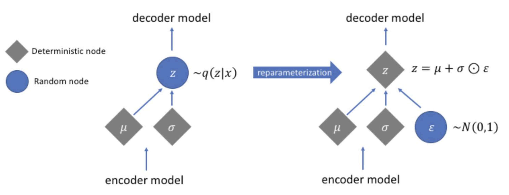
]

.footnote[credit: Marc Lelage]

---
## FlowVAE for realistic galaxies

Added in the Euclid simulation pipeline for generating realistic galaxies .red[from input properties] (ellipticity, magnitude, B/T, ...).

.center[
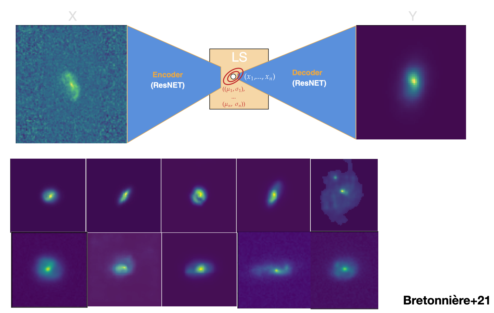
]

---
## Painting baryons

.center[
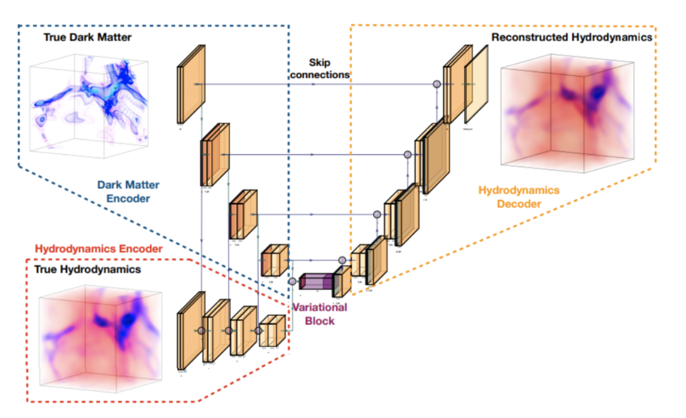
]

.footnote[Horowitz+21]

---
class: center, middle

# Generative adversarial networks

---
## GANs

The idea behing GANs is to train two networks jointly
* a discriminator $\mathbf{D}$ to classify samples as "real" or "fake"
* a generator $\mathbf{G}$ to map a fixed distribution to samples that fool $\mathbf{D}$

.center[
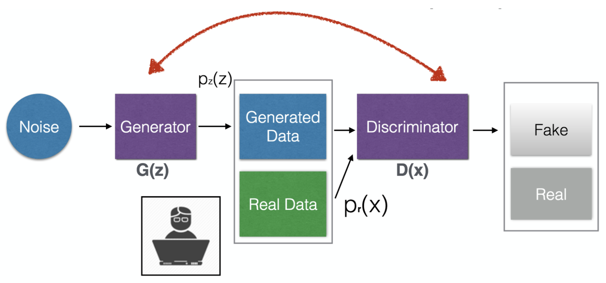
]

.footnote[
[Goodfellow et al. 2014](https://arxiv.org/abs/1406.2661)
]

---
## GAN training

The discriminator $\mathbf{D}$ .red[is a classifier] and $\mathbf{D}(x)$ is interpreted as the probability for $x$ to be a real sample.

The generator $\mathbf{G}$ takes as input a Gaussian random variable $z$ and produces a fake sample $\mathbf{G}(z)$.

The discriminator and the generator .red[are learned alternatively], i.e. when parameters of $\mathbf{D}$ are learned $\mathbf{G}$ is fixed and vice versa.

--

When $\mathbf{G}$ is fixed, the learning of $\mathbf{D}$ is the standard learning process of a binary classifier (sigmoid layer + BCE loss).

--

The learning of $\mathbf{G}$ is more subtle. The performance of $\mathbf{G}$ is evaluated thanks to the discriminator $\mathbf{D}$, i.e. the generator .red[maximizes] the loss of the discriminator.

---
## N-Body emulation

.center[
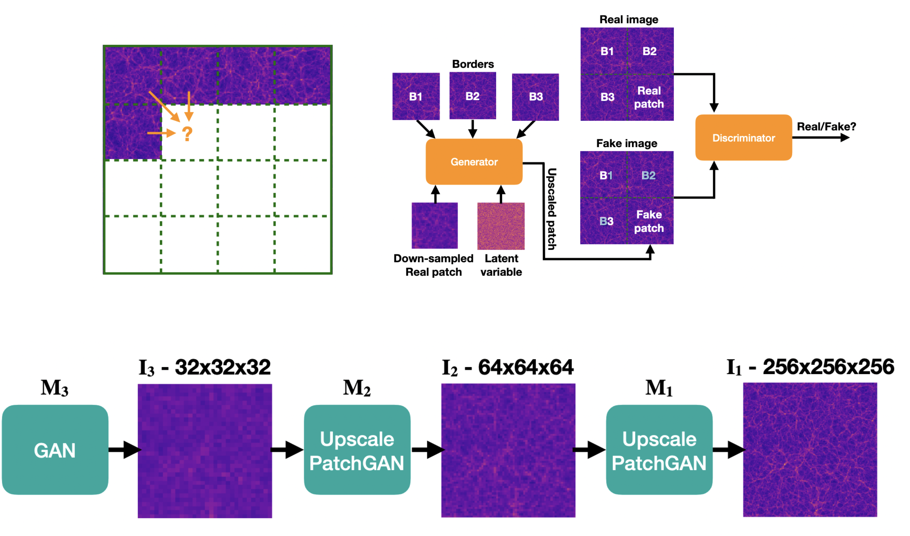
]

.footnote[Perraudin+19]

---
count: false
## N-Body emulation

.center[

]

.footnote[Perraudin+19]

---
## Generating is easy but...

estimating the density from data samples is hard

.center[
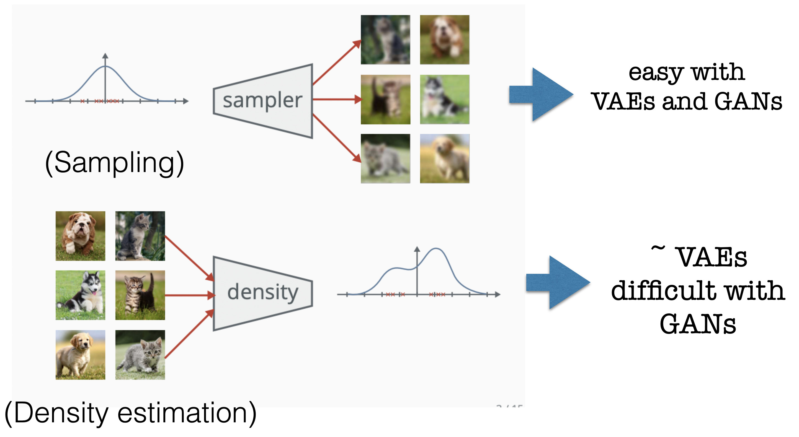
]

---
class: center, middle
name: density

# .red[Density estimation]

### _the trendy stuff_

---
## Normalising flows

.center[<iframe width="590" height="390" src="../img/vid/NF_explanation_justine.mp4" title="Justine NF explanation" frameborder="0" allow="accelerometer; clipboard-write; encrypted-media; gyroscope; picture-in-picture" allowfullscreen></iframe>]

.footnote[credit: Justine Zeghal]

---
## Cosmological constraints from SBI

.center[
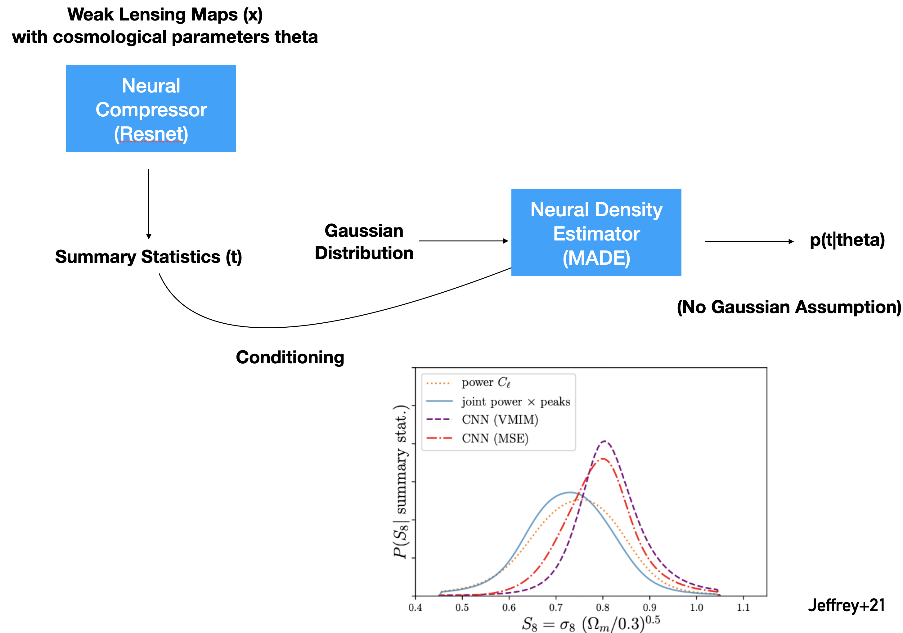
]

---
## Accelerating SBI with score

.center[
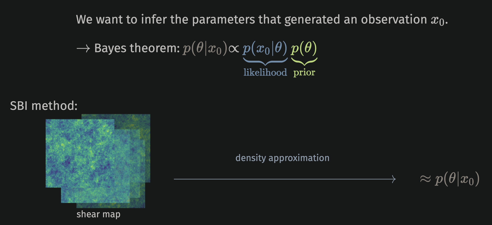
]

.center[see Justine's talk [here](https://justinezgh.github.io/talks/SummerSchool2022)]

.footnote[Zeghal+22]

---
class: center, middle

# Score-based models

### gradients of the data likelihood

---
## Denoising diffusion models

with stochastic differential equations (SDE)

Learn the distribution through a shochastic noise diffusion process

.center[

]

.footnote[credit: Yang Song – read his detailed [blog post](https://yang-song.net/blog/2021/score/)]

---
count: false
## Denoising diffusion models

with stochastic differential equations (SDE)

New samples are generated by reversing the SDE flow.

.center[

]

The process avoids the .red[mode collapse] inherent to GANs.

.footnote[credit: Yang Song – read his detailed [blog post](https://yang-song.net/blog/2021/score/)]

---
## Realistic galaxy simulations

.center[

]
.center[
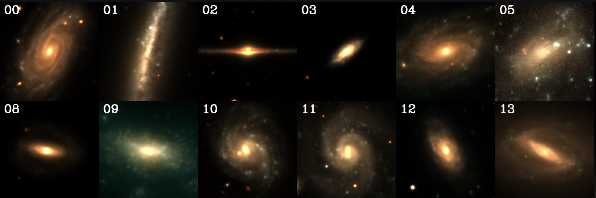
]

.footnote[Smith+21 + [GitHub](https://github.com/Smith42/astroddpm)]

---


---
class: center, middle
name: backup

# .red[Backup] slides

---
class: center, middle
name: practice

# In .red[practice]

#### training tips and optimisations

---
## The right architecture
<!-- class: middle -->

There is currently .red[no magic recipe] to find a network architecture 
that will solve your particular problem.

You will have to do .green[**a lot** of trial and error].

.center[
  # `¯\_(ツ)_/¯`
]

But here are some advice to guide you in the right direction  
and/or get you out of trouble.

---
## A community effort

.center.medium[
The Machine Learning community has long been  
a fervent advocate of  

.big.red[open source]  

which has fostered the spread of very recent developements even from big companies like Google.  

Both .green[code and papers] are generally available  
and can be found .green[within a few clicks].
]

---
## Start with existing (working) models

- look for a relevant architecture for your problem  
  (arXiv, blogs, websites)

.center[

]

---
count: false
## Start with existing (working) models

- look for a relevant architecture for your problem  
  (arXiv, blogs, websites)
- find an implementation on [GitHub][gh]  
  (often the case if algorithm is efficient)

.center[
 
]

---
count: false
## Start with existing (working) models

- look for a relevant architecture for your problem  
  (arXiv, blogs, websites)
- find an implementation on [GitHub][gh]  
  (often the case if algorithm is efficient)
- play with the examples and adjust to your inputs/outputs

--
- use [pretrained nets][kerasapp] for the  pre-processing of your data

--
- start tuning the model parameters..

[gh]: https://github.com/
[kerasapp]: https://keras.io/applications/

---
## Data is key

Deep neural nets need .red[a lot of data] to achieve good performance.

.center[]

---
count: false
## Data is key

Deep neural nets need .red[a lot of data] to achieve good performance.

Use .red[data augmentation].

.center[]

---
count: false
## Data is key

Deep neural nets need .red[a lot of data] to achieve good performance.

Use .red[data augmentation].

Choose a training set .red[representative] of your data.


--
If you cannot get enough labeled data, use simulations or turn to [transfer learning](https://keras.io/guides/transfer_learning/).

---
## Dropout

A % of random neurons are .green[switched off] during training  
it mimics different architectures being trained at each step 

.center[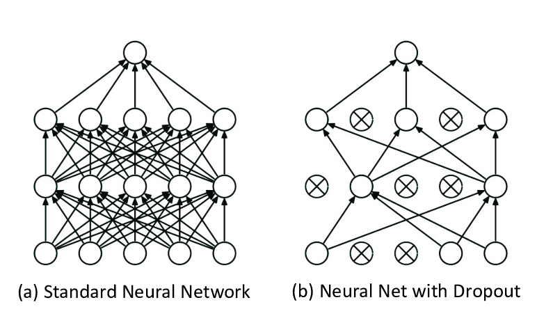]
.footnote[[Srivastava et al. (2014)](http://www.cs.toronto.edu/~rsalakhu/papers/srivastava14a.pdf)]

---
## Dropout

```python
...
dropout_rate = 0.1

model = tfk.Sequential()
model.add(tfkl.Conv2D(2, (3, 3), activation='relu', input_shape=(9, 9, 1)))
*model.add(tfkl.Dropout(dropout_rate))
model.add(tfkl.Conv2D(4, (3, 3), activation='relu'))
*model.add(tfkl.Dropout(dropout_rate))
...
```

- efficient regularization technique 
- .green[prevents overfitting]

**Note:** dropout is .red[not used during evaluation], which accounts for a small gap between **`loss`** and **`val_loss`** during training.


.footnote[[Srivastava et al. (2014)](http://www.cs.toronto.edu/~rsalakhu/papers/srivastava14a.pdf)]

---
## Batch normalization

```python
...
model = tfk.Sequential()
model.add(tfkl.Conv2D(..., activation=None))
model.add(tfkl.Activation('relu'))
*model.add(tfkl.BatchNormalization())
```

- technique that .green[adds robustness against bad initialization]
- forces activations layers to take on a unit gaussian distribution at the beginning of the training
- ongoing debate on whether this must be used before or after activation  
  => current practices (2022) seem to favor .red[after activation] 

.footnote[[Ioffe & Szegedy (2015)](http://arxiv.org/abs/1502.03167)]

---
## Skip connections

.left-column[
- The skip connection, also know as a .red[residual block], .green[bypasses the convolution block] and concatenates the input with the output.  
- It allows the gradients to be better propagated back to the first layers and solves the .blue[*vanishing gradients*] problem.
]

.right-column[

A skip connection looks like this
  .center[]

They are at the heart of [ResNet](https://arxiv.org/abs/1512.03385) and [UNet](https://arxiv.org/abs/1505.04597).
]

---
## Skip connections

.left-column[
```python
d = {"activation": "relu", 
     "padding": "same"}

def resblock(inputs):
  x = tfkl.Conv2D(64, 3, **d)(inputs)
  x = tfkl.Conv2D(64, 3, **d)(x)
  return tfkl.add([inputs, x])

inputs = tfk.Input(shape=(32, 32, 3))
x = tfkl.Conv2D(32, 3, **d)(inputs)
x = tfkl.Conv2D(64, 3, **d)(x)
x = tfkl.MaxPooling2D()(x)
*x = resblock(x)
*x = resblock(x)
x = tfkl.Conv2D(64, 3, **d)(x)
x = tfkl.GlobalAveragePooling2D()(x)
x = tfkl.Dense(256, "relu")(x)
x = tfkl.Dropout(0.5)(x)
outputs = tfkl.Dense(10)(x)

model = tfk.Model(inputs, outputs)
```
]

.right-column[

One needs to use .green[the functional API] of Keras/TensorFlow in order to write residual blocks since they are no longer sequential.  

On the left is a short model with two residual blocks in it.  

⚠️ The convolution layers in the residual block .red[must preserve the tensor shape] in order to be concatenated.
]


---
## and a few more tricks..

Here are some leads (random order) to explore if your model do not converge:
- [data normalization](https://www.jeremyjordan.me/batch-normalization/)
- [weight initialization](https://medium.com/usf-msds/deep-learning-best-practices-1-weight-initialization-14e5c0295b94)
- [choice of learning rate](http://www.bdhammel.com/learning-rates/)
- [gradient clipping](https://machinelearningmastery.com/exploding-gradients-in-neural-networks/)
- [various regularisation techniques](https://machinelearningmastery.com/how-to-reduce-overfitting-in-deep-learning-with-weight-regularization/)

---
exclude: true
## Next ?

.medium[ML developments are happening at a high pace,  
.red[stay tuned] !  

A .green[curated list] of inspirations for this presentation  
can be found [here][refs].
]

[refs]: https://github.com/aboucaud/slides/blob/master/2018/hands-on-deep-learning/references.md

---
exclude: true
class: center, middle

# Thank .red[you]
</br>
</br>
.medium[Contact info:]  
[aboucaud.github.io][website]  
@aboucaud on GitHub, GitLab  
[@alxbcd][twitter] on Twitter

[website]: https://aboucaud.github.io
</br>
</br>
</br>
</br>
.small[
  This presentation is licensed under a   
  [Creative Commons Attribution-ShareAlike 4.0 International License][cc]
]

[][cc]

[cc]: http://creativecommons.org/licenses/by-sa/4.0
