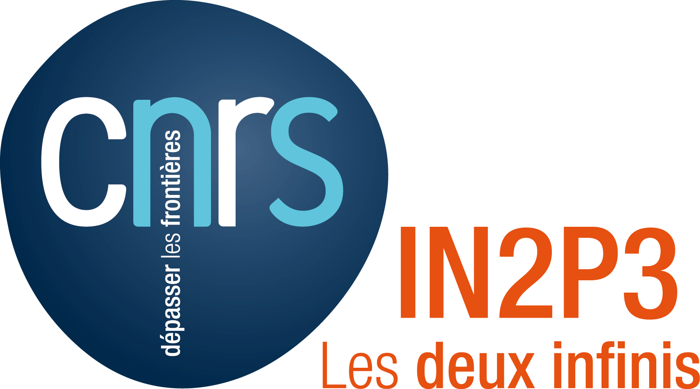
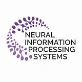
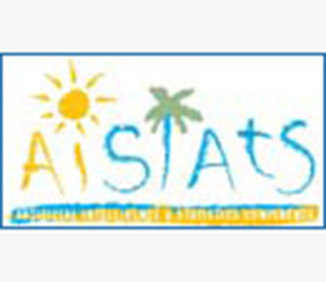
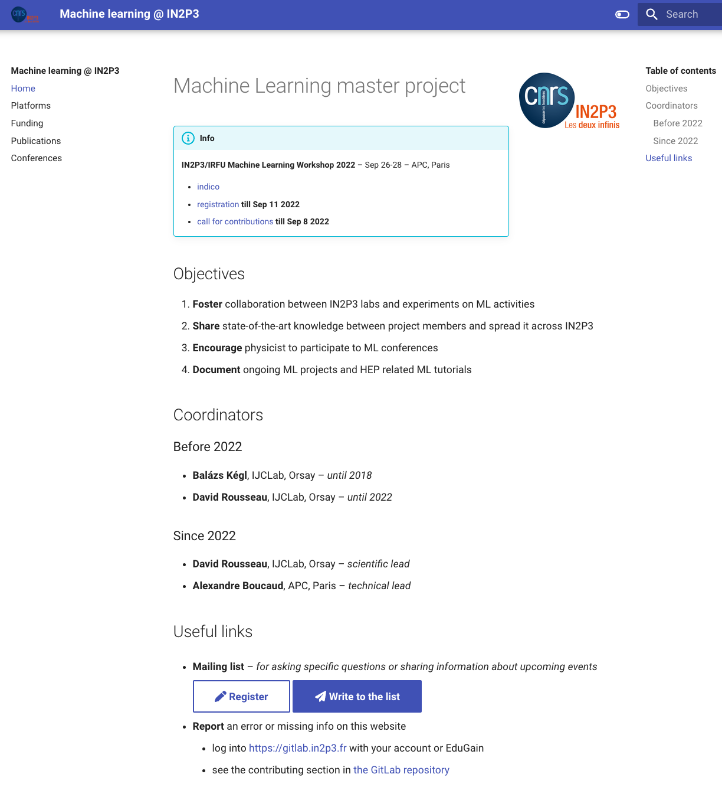
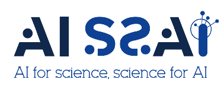

class: middle
background-image: url(../img/brain.png)

# Machine learning

#### Journées R&T IN2P3 – 19 octobre 2022
#### [Alexandre Boucaud][alex] (APC) & [David Rousseau][david] (IJCLab)
#### https://machine-learning.in2p3.fr

[alex]: mailto:aboucaud@apc.in2p3.fr
[david]: mailto:rousseau@lal.in2p3.fr

.bottomlogo[
   
]

---

# Master projet

- master projet : **Machine learning**
- projet : **CompStat**
- responsable scientifique : David Rousseau
- responsable technique : .green[Alexandre Boucaud]
- budget 2022 : 14K€ fourni par Sabine (DAS calcul)
- une liste de diffusion : [machine-learning-l@in2p3.fr][listeml]
  - inscription 👉 [ici][registerml]
- un workshop annuel **ML @ IN2P3/IRFU**
  - [édition 2021][workshop21]
  - [.green[édition 2022]][workshop22] | [.green[webcast]][webcast22]
- un site web _(en construction)_
  - https://machine-learning.in2p3.fr

[listeml]: mailto:machine-learning-l@in2p3.fr
[registerml]: https://listserv.in2p3.fr/cgi-bin/wa?A0=MACHINE-LEARNING-L
[workshop21]: https://indico.in2p3.fr/event/22938/
[workshop22]: https://indico.in2p3.fr/event/27507/
[webcast22]: https://webcast.in2p3.fr/container/machine-learning-workshop-in2p3-irfu

---

# Objectifs

.left-column[
favoriser le .blue[**développement**] du ML à l'IN2P3
  
contribuer à la .blue[**formation**] du personnel à travers les écoles thématiques

encourager les .blue[**collaborations**] entre membres de l'IN2P3 et .blue[**avec des spécialistes**] du domaine + **thèses en cotutelle**

envoyer des scientifiques IN2P3 aux .blue[**conférences spécialisées ML**]
]

--

.right-column[
  .small[
Ecoles
  - [ANF Machine Learning](https://webcast.in2p3.fr/container/machine-learning-pour-informaticiens) (2020)
  - [AstroInfo](https://astroinfo2021.sciencesconf.org/) (2021)
  - [School of Statistics](https://indico.in2p3.fr/e/SOS2022) (2022)

Workshops
  - [Learning to Discover](https://indico.ijclab.in2p3.fr/event/5999/) (Orsay, 2022)
  - [Bayesian deep learning for cosmology](https://indico.in2p3.fr/event/26887/) (Paris, 2022)

Conférences

]
]

---

# Exemples d'application

- traitement .red[automatisé] de données  .right[_classification, régression, segmentation, détection d'anomalies_]
  
- .red[compression de données] .right[_réduction de dimensions, clustering_]
  
- modèles .red[génératifs] .right[_accélération des simulations numériques_]

- .red[temps-réel] / embarqué .right[_accélération des pipelines, GPU/FPGA_]

- .red[...]

---

# Points marquants de l'année écoulée

.green[**rebond**] post-confinement(s)
  - 2 écoles thématiques 
  - 1 workshop national (APC) + 2 workshops/conf. internationaux (APC + IJCLab)
  - envoi de 5 PhD/postdocs aux conférences ML
  - présentation au conseil scientifique calcul et données
  
.green[**intérêt**] sans cesse .green[**grandissant**]
  - inscrits liste de diffusion ↗️ 40% depuis oct. 2021

mise en place du .green[**site internet**] 

.big.center[https://machine-learning.in2p3.fr]

---

# Site web (1/2)

.left-column[
  .center[
    
  ]
]

.right-column[
- .blue[**moyens de calcul**] et liens utiles vers manuels de démarrage

- recensement des .blue[**financements**] (ANR, ERC, ...) et des .blue[**thèses**] avec forte composante ML

- calendrier des .blue[**conférences/workshops**] avec dates clés et bientôt des .blue[**écoles**]

- listing des .blue[**publications**] ML avec contribution forte IN2P3
]

---

# Site web (2/2)

.left-column[
pensé pour être un espace collaboratif 
  - développé sur https://gitlab.in2p3.fr
  - tout personnel in2p3 a accès  
    et est encouragé à y contribuer

liste des publications construite à partir d'un fichier BibTeX
  - .red[automatisation] du remplissage
  - permet de .red[récupérer un listing des publications] pour citer le travail
  - délègue la responsabilité de l'absence d'une publication à son auteur
]

.right-column[
  .center[
    
  ]
]

---

# Semestre thématique AISSAI

AISSAI est un [centre interdisciplinaire du CNRS][aissai] mis en place en 2021 pour encourager les échanges entre les domaines scientifiques utilisant le machine learning.

Les moyens mis en place pour y parvenir sont principalement .green[des semestres thématiques] comprenant des écoles, ateliers, visites de professeurs/chercheurs.

L'IN2P3 a été désignée pour organiser le 3e semestre thématique à l'automne 2023
  - soutien à des écoles par labellisation (les Houches, AstroInfo, ...)
  - travail en cours pour établir les thèmes des 3 workshops à organiser
  - plus d'infos sur https://gitlab.in2p3.fr/machine-learning/aissai-semester

.bottomlogo[
   
]

[aissai]: https://www.cnrs.fr/fr/a-propos-du-centre-aissai

---

# Projets pour 2022/2023

.blue[**finalisation collective**] du site web
  - thèses, financements passés et en cours et recueil des publications avec contribution IN2P3

organisation du .green[**semestre thématique AISSAI**] à l'automne 2023
  - 3 workshops thématiques .small[(thèmes à déterminer rapidement)]
  - formations / écoles .small[(pas de workshop IN2P3/IRFU avant début 2024)]
  - invitation de scientifiques internationaux reconnus en ML

continuer la contribution aux workshops/écoles + envoi de physiciens aux conférences

développer l'.blue[**accueil de visiteurs**] .small[(plusieurs expressions d'intérêt)]

---

# Conclusions

- Un domaine .red[**en plein essor**] à l'IN2P3, avec utilisation de techniques de pointe
  
- Connaissances de base de plus en plus répandues, et accès aux ressources facilité

- De .red[**nombreuses applications possibles**] dans chaque domaine  
  &nbsp;&nbsp;&nbsp;HEP / cosmologie / science des accélérateurs

- .green[**Semestre thématique AISSAI / IN2P3**] à venir à l'automne 2023  
  &nbsp;&nbsp;&nbsp;couplé à un renforcement des actions de formation à destination des personnels

&nbsp;&nbsp;&nbsp;

.big.center[✏️ Inscrivez vous sur la liste [machine-learning-l@in2p3.fr][registerml] !]