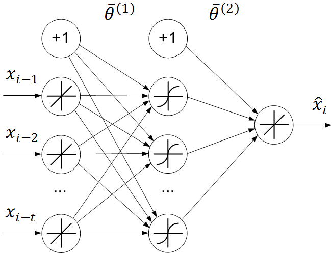
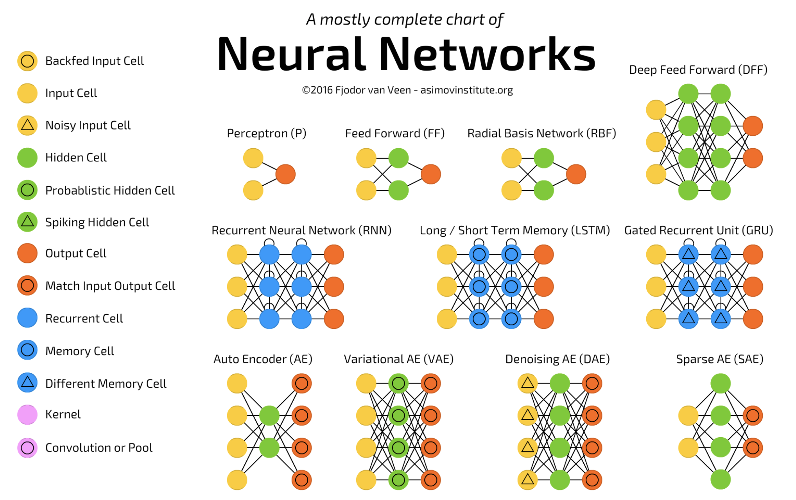
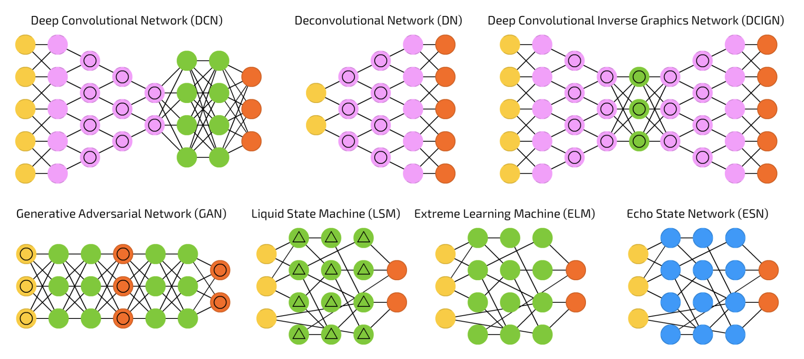

class: middle
background-image: url(img/brain.png)

# Hands on .red[neural networks]
<!-- #### MML - Cours 08 -->

<!-- .bottomlogo[] -->

.footnote[ Alexandre Boucaud  -  [@alxbcd][twitter]]

[twitter]: https://twitter.com/alxbcd
---
class: middle
background-image: url(img/brain.png)
.hidden[aa]
# Hands on .red[neural networks]
.small[with [Keras][keras] examples]
.footnote[Alexandre Boucaud  -  [@alxbcd][twitter]]

[mail]: mailto:aboucaud@apc.in2p3.fr
[twitter]: https://twitter.com/alxbcd

---
## Outline

.medium[
* [neurons](#nns)
  
* [hidden layers](#layer)
  
* [activation](#activation)
  
* [backpropagation](#backprop)
  
* [training](#train)
  
* [hands-on tutorial](#tuto)
]
---
## Foreword

The following slides provide examples of neural network models written in _Python_, using the [Keras][keras] library and [TensorFlow][tf] tensor ordering convention*. 

Keras provides a high level API to create deep neural networks and train them using numerical tensor libraries (_backends_) such as [TensorFlow][tf], [CNTK][cntk] or [Theano][theano].


[keras]: https://keras.io/
[tf]: https://www.tensorflow.org/
[cntk]: https://docs.microsoft.com/fr-fr/cognitive-toolkit/
[theano]: http://www.deeplearning.net/software/theano/

.center[
  
]

.footnote[*channels last]

---
class: middle, center

# What is a .red[neural network] made of ?

---
name: nns
## A Neuron

A neuron is a .green[linear system] with two attributes
> the weight matrix $\mathbf{W}$  
> the linear bias $b$

It takes .green[multiple inputs] (from $\mathbf{x}$) and returns .green[a single output]
> $f(\mathbf{x}) = \mathbf{W} . \mathbf{x} + b $
.center[
  
]

---
name: layer
## Linear layers

A linear layer is an .green[array of neurons].

A layer has .green[multiple inputs] (same $\mathbf{x}$ for each neuron) and returns .green[multiple outputs].

.center[
  <!--  -->
  
]

---
## Hidden layers

All layers internal to the network (not input or output layer) are considered .green[hidden layers].

.center[]

.footnote[[cs231n.github.io](http://cs231n.github.io/)]

---
## Multi-layer perceptron (MLP)


.left-column[
```python
from keras.models import Sequential
from keras.layers import Dense

# initialize model
model = Sequential()

# add layers
model.add(Dense(4, input_dim=3))
model.add(Dense(4))
model.add(Dense(1))
```
]

.right-column[

]

---
count: false
## Multi-layer perceptron (MLP)
.left-column[
```python
from keras.models import Sequential
from keras.layers import Dense

# initialize model
model = Sequential()

# add layers
model.add(Dense(4, input_dim=3))
model.add(Dense(4))
model.add(Dense(1))
```
]
.right-column[

]

.hidden[aa]
.reset-column[]
.center[
.huge[QUESTION:]</br></br>
.big[How many .red[free parameters] has this model ?]
]

---
count: false
## Multi-layer perceptron (MLP)
.left-column[
```python
from keras.models import Sequential
from keras.layers import Dense

model = Sequential()

model.add(Dense(4, input_dim=3))
model.add(Dense(4))
model.add(Dense(1))

# print model structure
model.summary()
```
]
.right-column[

]
.reset-column[
```
__________________________________________________
Layer (type)          Output Shape        Param #
==================================================
dense_1 (Dense)       (None, 4)           16         <=   W (3, 4)   b (4, 1)
__________________________________________________
```
]

---
count: false
## Multi-layer perceptron (MLP)
.left-column[
```python
from keras.models import Sequential
from keras.layers import Dense

model = Sequential()

model.add(Dense(4, input_dim=3))
model.add(Dense(4))
model.add(Dense(1))

# print model structure
model.summary()
```
]
.right-column[

]
.reset-column[
```
__________________________________________________
Layer (type)          Output Shape        Param #
==================================================
dense_1 (Dense)       (None, 4)           16
__________________________________________________
dense_2 (Dense)       (None, 4)           20         <=   W (4, 4)   b (4, 1)
__________________________________________________
```
]

---
count: false
## Multi-layer perceptron (MLP)
.left-column[
```python
from keras.models import Sequential
from keras.layers import Dense

model = Sequential()

model.add(Dense(4, input_dim=3))
model.add(Dense(4))
model.add(Dense(1))

# print model structure
model.summary()
```
]
.right-column[

]
.reset-column[
```
__________________________________________________
Layer (type)          Output Shape        Param #
==================================================
dense_1 (Dense)       (None, 4)           16
__________________________________________________
dense_2 (Dense)       (None, 4)           20
__________________________________________________
dense_3 (Dense)       (None, 1)           5          <=   W (4, 1)   b (1, 1)
==================================================
Total params: 41
Trainable params: 41
Non-trainable params: 0
```
]

---
exclude: True

## Multi-layer perceptron (MLP)

```python
from keras.models import Sequential
from keras.layers import Dense

# initialize model
model = Sequential()

# add layers
model.add(Dense(4, input_dim=3))
model.add(Dense(4))
model.add(Dense(1))
```

--
exclude: True
```python
# print model structure
model.summary()
```

--
exclude: True
```bash
_________________________________________________________________
Layer (type)                 Output Shape              Param #
=================================================================
dense_1 (Dense)              (None, 4)                 16
_________________________________________________________________
dense_2 (Dense)              (None, 4)                 20
_________________________________________________________________
dense_3 (Dense)              (None, 1)                 5
=================================================================
Total params: 41
Trainable params: 41
Non-trainable params: 0
```

---
name: activation
## Adding non linearities

A network with several linear layers remains a .green[linear system].

--

To add non-linearities to the system, .red[activation functions] are introduced. 

.center[]

---
count: false
## Adding non linearities

A network with several linear layers remains a .green[linear system].

To add non-linearities to the system, .red[activation functions] are introduced. 

.center[]

.footnote[credit: Alexander Chekunkov]

---

## Activation functions 

.hidden[a]  
.left-column[.blue[activation function] ]
.green[its derivative]


.center[]


An extended list of activation functions can be found on [wikipédia](https://en.wikipedia.org/wiki/Activation_function).

---

## Activation layer

There are two different syntaxes whether the activation is seen as a .green[property] of the neuron layer

```python
model = Sequential()
model.add(Dense(4, input_dim=3, activation='sigmoid'))
```

--

or as an .green[additional layer] to the stack

```python
from keras.layers import Activation

model = Sequential()
model.add(Dense(4, input_dim=3))
model.add(Activation('tanh'))
```

--
The activation layer .red[does not add] any .red[depth] to the network.

---
## Simple network


One neuron, one activation function.


.center[]

$$x \overset{neuron}\longrightarrow z(x) = wx + b\overset{activation}\longrightarrow a(x) = g(z(x)) = y$$


---
## Feed forward

$$ x \overset{neuron}\longrightarrow z(x) = wx + b\overset{activation}\longrightarrow a(x) = g(z(x)) = y$$
We propagate an input $x$ through the network and compare the result $y$ with the expected value $y_t$ using the loss function
$$ \ell = loss(y, y_t)$$

--
.hidden[a]
.center.red[How do we quantify the impact of $w$ and $b$ on the loss $\ell$ ?]

--
.hidden[a]
$$ \dfrac{\partial \ell}{\partial w} \quad \text{and} \quad \dfrac{\partial \ell}{\partial b} $$

---
name: backprop
## Backpropagation

A .green[30-years old] algorithm (Rumelhart et al., 1986)

which is .red[key] for the re-emergence of neural networks today.

.center[]

.footnote[credit: Alexander Chekunkov]

---
## Chain rule

Backpropagation works if networks are .green[differentiable].

.red[Each layer] must have an analytic derivative expression.

$$ x \overset{neuron}\longrightarrow z(x) = wx + b\overset{activation}\longrightarrow a(x) = g(z(x)) = y$$

--
Since $w$ and $b$ are also variables
$$ z(x, w, b) = wx + b\,, $$
the gradients can be expressed as
$$ \dfrac{\partial z}{\partial x} = w\,, \quad \dfrac{\partial z}{\partial w} = x \quad\text{and}\quad \dfrac{\partial z}{\partial b} = 1\,. $$
---
count:false
## Chain rule

Backpropagation works if networks are .green[differentiable].

.red[Each layer] must have an analytic derivative expression.

$$ x \overset{neuron}\longrightarrow z(x) = wx + b\overset{activation}\longrightarrow a(x) = g(z(x)) = y$$

Then the .red[chain rule] can be applied :

$$ \dfrac{\partial \ell}{\partial w} =
   \dfrac{\partial \ell}{\partial a} \cdot 
   \dfrac{\partial a}{\partial z} \cdot 
   \dfrac{\partial z}{\partial w} = \nabla loss(y) \cdot g'(z) \cdot x $$
and
$$ \dfrac{\partial \ell}{\partial b} =
   \dfrac{\partial \ell}{\partial a} \cdot 
   \dfrac{\partial a}{\partial z} \cdot 
   \dfrac{\partial z}{\partial b} = \nabla loss(y) \cdot g'(z)$$

---
## Network with more layers

Let's add one layer (with a single neuron) with the .green[same] activation $g$
<!-- $$ x \longrightarrow z_1 = w_1x + b_1\longrightarrow a_1 = g(z_1(x)) \downarrow$$ -->
<!-- $$  y = a_2 = g(z_2(x)) \longleftarrow z_2 = w_2a_1 + b_2$$ -->
$$ x \longrightarrow z_1 = w_1x + b_1\longrightarrow a_1 = g(z_1(x)) \rightarrow$$
$$ \rightarrow z_2 = w_2a_1 + b_2 \longrightarrow a_2 = g(z_2(x)) = y $$
--
.center.red[How do we compute the gradients of $w_1$ : $\dfrac{\partial\ell}{\partial w_1}$ ?]
--
.footnote[Hint: remember the algorithm is called .green[backpropagation]]

---
## Network with more layers

Let's add one layer (with a single neuron) with the .green[same] activation $g$
<!-- $$ x \longrightarrow z_1 = w_1x + b_1\longrightarrow a_1 = g(z_1(x)) \rightarrow$$
$$ \rightarrow z_2 = w_2a_1 + b_2 \longrightarrow a_2 = g(z_2(x)) = y $$ -->
$$ x \longrightarrow z_1 = w_1x + b_1\longrightarrow a_1 = g(z_1(x)) \rightarrow$$
$$ \rightarrow z_2 = w_2a_1 + b_2 \longrightarrow a_2 = g(z_2(x)) = y $$
We use the .red[chain rule]

$$ \dfrac{\partial \ell}{\partial w_1} =
   \dfrac{\partial \ell}{\partial a_2} \cdot 
   \dfrac{\partial a_2}{\partial z_2} \cdot 
   \dfrac{\partial z_2}{\partial a_1} \cdot 
   \dfrac{\partial a_1}{\partial z_1} \cdot 
   \dfrac{\partial z_1}{\partial w_1} $$
--
which simplifies to

$$ \dfrac{\partial \ell}{\partial w_1} =
   \nabla loss(y) \cdot 
   g'(z_2) \cdot 
   w_2 \cdot 
   g'(z_1) \cdot 
   x $$
   <!-- = \dfrac{\partial \ell}{\partial a} \cdot g'(z) \cdot x $$ -->

---
## Network with more layers

From the latest expression

$$ \dfrac{\partial \ell}{\partial w_1} =
   \left(
     \nabla loss(y) \cdot 
     g'(z_2) \cdot 
     w_2 \right)\cdot 
   g'(z_1) \cdot 
   x $$

one can derive the algorithm to compute .green[the gradient for a layer] $z_i$
$$ \dfrac{\partial \ell}{\partial z_i} =
\left(
\left(\nabla loss(y) \cdot 
  g'(z_n) \cdot 
  w_n \right) \cdot 
  g'(z^{n-1}) * w^{n-1}\right)
  [\dots]  \cdot g'(z_i) $$

which can be re-written as .red[a recursion]

$$ \dfrac{\partial \ell}{\partial z_i} = \dfrac{\partial \ell}{\partial z^{i+1}} \cdot w^{i+1} \cdot g'(z_i) $$

--
.footnote[find a clear and more detailed explaination of backpropagation [here](https://www.jeremyjordan.me/neural-networks-training/)]

---
name: train
## Loss and optimizer

Once your architecture (`model`) is ready, a [loss function](https://keras.io/losses/) and an [optimizer](https://keras.io/optimizers/) .red[must] be specified 
```python
model.compile(optimizer='adam', loss='binary_crossentropy')
```
or with better access to optimization parameters
```python
from keras.optimizers import Adam
from keras.losses import binary_crossentropy

model.compile(optimizer=Adam(lr=0.01, decay=0.1), 
              loss=binary_crossentropy)
```

Choose both according to the target output.

---
## Network update

1. feedforward and compute loss gradient on the output
$$ \nabla loss(y) $$

2. for each layer in the backward direction, 
  * .blue[receive] the gradients from the previous layer, 
  * .blue[compute] the gradient of the current layer
  * .blue[multiply] with the weights and .blue[pass] the results on to the next layer

3. for each layer, update their weight and bias using their own gradient, following the optimisation scheme (e.g. gradient descent)


---
## Training

It's time to .green[train] your model on the data (`X_train`, `y_train`). 

```python
model.fit(X_train, y_train,
          batch_size=32,        
          epochs=50,  
          validation_split=0.3) # % of data being used for val_loss evaluation

```

- **`batch_size`**: .green[\# of images] used before updating the model<br/>
  32 is a very good compromise between precision and speed*
- **`epochs`**: .green[\# of times] the model is trained with the full dataset

After each epoch, the model will compute the loss on the validation set to produce the **`val_loss`**. 

.red[The closer the values of **`loss`** and **`val_loss`**, the better the training]. 

.footnote[*see [Masters et al. (2018)](https://arxiv.org/abs/1804.07612)]

---
## Plot the training loss

```python
import matplotlib.pyplot as plt

history = model.fit(X_train, y_train, validation_split=0.3)  

# Visualizing the training                    
plt.plot(history.history['loss'], label='training')
plt.plot(history.history['val_loss'], label='validation')
plt.xlabel('epochs'); plt.ylabel('loss'); plt.legend()
```

.center[]

---

## Plot the training loss

And look for the training .green[sweet spot] (before .red[overfitting]).

.center[]

---
## Plot other metrics

```python
import matplotlib.pyplot as plt

model.compile(..., metrics=['acc'])  # computes other metrics, here accuracy

history = model.fit(X_train, y_train, validation_split=0.3)

# Visualizing the training                    
plt.plot(history.history['acc'], label='training')
plt.plot(history.history['val_acc'], label='validation')
plt.xlabel('epochs'); plt.ylabel('accuracy'); plt.legend()
```

.center[]

---
class: center, middle
name: architectures

# Common .red[architectures]

---
## Zoo of neural networks #1
.singleimg[]

.footnote[[Neural network zoo][nnzoo] - Fjodor van Veen (2016)]

---
## Zoo of neural networks #2

.singleimg[]

.footnote[[Neural network zoo][nnzoo] - Fjodor van Veen (2016)]

[nnzoo]: http://www.asimovinstitute.org/neural-network-zoo/

---
exclude: true
class: center, middle

# Thank .red[you]
</br>
</br>
.medium[Contact info:]  
[aboucaud.github.io][website]  
@aboucaud on GitHub, GitLab  
[@alxbcd][twitter] on Twitter

[website]: https://aboucaud.github.io
</br>
</br>
</br>
</br>
.small[
  This presentation is licensed under a   
  [Creative Commons Attribution-ShareAlike 4.0 International License][cc]
]

[][cc]

[cc]: http://creativecommons.org/licenses/by-sa/4.0

---
exclude: true
class: center, middle

La semaine prochaine :

# .red[Convolutional] neural networks